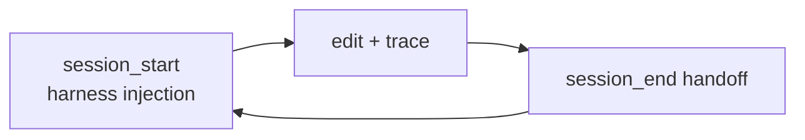

# Engram

[](https://github.com/staticroostermedia-arch/engram/actions)
[](https://github.com/modelcontextprotocol)
[](https://glama.ai/mcp/servers/staticroostermedia-arch/engram)
[](LICENSE)
[](PATENT-NOTICE.md)
[](docs/GEOMETRIC_MEMORY.md)

> **Engram** is the project. **EngramGrok** is the Grok Build integration (plugin + lean MCP profile). Same substrate — different entry paths.

**Local geometric memory for AI agents** — not a vector database or a pile of markdown files. One-call wake with **harness injection** (`suggested_actions` at `session_start`), anchor-first recall, edit-scoped spatial context, structured session handoff. **8 essential MCP tools** (66 tiered for power users). Runs on your machine. No cloud. No API keys.

| Start here | Doc |
|------------|-----|
| **Grok Build / xAI reviewers** | [docs/GROK_BUILD_MEMORY.md](docs/GROK_BUILD_MEMORY.md) |
| **Any agent (lean contract)** | [docs/AGENT_MEMORY_CONTRACT.md](docs/AGENT_MEMORY_CONTRACT.md) + [FIRST_RUN.md](FIRST_RUN.md) |
| **Ritual skills** | [SKILLS.md](SKILLS.md) → `docs/skills/` |
| **Deep operators** | [HOW_WE_ACTUALLY_USE_THIS_IN_2026.md](HOW_WE_ACTUALLY_USE_THIS_IN_2026.md) |
| **Substrate builders (BYOP)** | [AGENT_INTEGRATION_GUIDE.md](AGENT_INTEGRATION_GUIDE.md) |

**Human review:** `./scripts/leg` (static) or `./scripts/leg --live` — traces, goals, momentum, Thought Tiles.

---

## Why not flat RAG?

| | Flat vector / markdown | Engram |
|--|------------------------|--------|
| Storage | append-log / chunks | 256KB geometric blocks (q/p/CRS/Merkle) |
| Wake | cold start | `session_start` + harness injection + handoff |
| Integrity | none | `verify_*`, scars, CRS ≥ 0.74 |
| Code context | RAG chunks | `context_for_edit` + spatial AABB |
| Agent discipline | hope | rituals + subvisor H¹ + process sheaf |

Full comparison vs mem0/Letta/chroma: see [docs/GROK_BUILD_MEMORY.md](docs/GROK_BUILD_MEMORY.md).

---

## Quick start

```bash
git clone https://github.com/staticroostermedia-arch/engram.git
cd engram
cargo build -p engram-server
target/debug/engram --version   # 0.5.0
```

**MCP config** (Grok Build / Cursor — use `scripts/engram-grok`):

```json
{
  "mcpServers": {
    "engram": {
      "command": "/path/to/engram/scripts/engram-grok",
      "args": ["mcp"],
      "env": {
        "ENGRAM_STORE": "~/.engram/stalks/",
        "ENGRAM_PROFILE": "agent"
      }
    }
  }
}
```

Restart your IDE, then:

```
mcp_engram_session_start(intent="your goal")
```

**Lean loop:** `session_start` → `context_for_edit(path)` → `recall(scope=anchors)` → `quick_trace` / `remember` → `session_end(summary)`.

All ecosystems: [integrations/README.md](integrations/README.md). Cursor ambient wake: `./scripts/cursor-engram-preflight.sh`.

---

## Memory model (one paragraph)

Fixed **256KB HolographicBlocks** (.leg3): 8192D phase (q), momentum (p), CRS lawfulness, BLAKE3 Merkle, spatial AABB. **VSA calculus** + **sheaf gluing** via `processes/*.toml` (rituals, harness, monitor). **NREM / ego.leg3** for long-horizon continuity. Details: [docs/GEOMETRIC_MEMORY.md](docs/GEOMETRIC_MEMORY.md), [docs/RITUALS.md](docs/RITUALS.md), [docs/HARNESS_INJECTION.md](docs/HARNESS_INJECTION.md).

**Linguistic calculus** (words + numbers in the same sheaf): [docs/CATEGORICAL_LINGUISTIC_CALCULUS.md](docs/CATEGORICAL_LINGUISTIC_CALCULUS.md).



---

## Examples

| File | What it does |
|------|----------------|
| [examples/hello-engram-agent.py](examples/hello-engram-agent.py) | Minimal MCP loop |
| [examples/mcp_client.py](examples/mcp_client.py) | Session + recall + relate + verify |
| [examples/ritual_verify.md](examples/ritual_verify.md) | Code Edit Ritual walkthrough |
| [docs/examples/marketplace_demo.md](docs/examples/marketplace_demo.md) | Grok plugin demo |

Build against `target/debug/engram` during development.

---

## MCP tools

**8 essential** for daily work — full map: [docs/TOOL_DECISION_MAP.md](docs/TOOL_DECISION_MAP.md). Categorized reference: [docs/MCP_TOOLS_REFERENCE.md](docs/MCP_TOOLS_REFERENCE.md).

Grok plugin slash commands: [grok-plugin-engram/commands/](grok-plugin-engram/commands/).

---

## Deep dive (linked, not repeated here)

| Topic | Doc |
|-------|-----|
| 256KB / NVMe / GPU backends | [docs/architecture.md](docs/architecture.md) |
| CRS / scars / lawfulness | [docs/GEOMETRIC_MEMORY.md](docs/GEOMETRIC_MEMORY.md) |
| Process sheaf + sub-agent governance | [processes/README.md](processes/README.md) |
| Substrate wins roadmap | [docs/SUBSTRATE_WINS_PLAN.md](docs/SUBSTRATE_WINS_PLAN.md) |
| Marketplace submission | [docs/MARKETPLACE_SUBMISSION.md](docs/MARKETPLACE_SUBMISSION.md) |
| Philosophy | [MANIFESTO.md](MANIFESTO.md) |

**Hardware:** CPU (default), CUDA, ROCm, Metal, WebGPU — see [docs/DEPLOYMENT_MODES.md](docs/DEPLOYMENT_MODES.md).

**CLI:** `engram remember|recall|forget|list|ingest|trace|distill|build-index`

**Namespaces:** `mcp_engram_set_namespace("project")` or `~/.engram/sheaf.toml`

---

## Contributing

[CONTRIBUTING.md](CONTRIBUTING.md) · [AGENTS.md](AGENTS.md) · PR checklist in [.github/PULL_REQUEST_TEMPLATE.md](.github/PULL_REQUEST_TEMPLATE.md)

Dev build: `cargo build -p engram-server && target/debug/engram --version`

---

## License

**AGPL-3.0-only**. `.leg3` format: U.S. Patent Application No. 19/372,256 (pending). Commercial licenses: StaticRoosterMedia@gmail.com — [PATENT-NOTICE.md](PATENT-NOTICE.md).