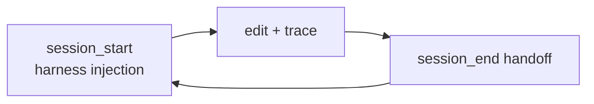

# EngramGrok

[](https://github.com/staticroostermedia-arch/engram/actions)
[](https://github.com/modelcontextprotocol)
[](https://glama.ai/mcp/servers/staticroostermedia-arch/engram)
[](LICENSE)
[](PATENT-NOTICE.md)
[](docs/GEOMETRIC_MEMORY.md)

**Persistent geometric memory for AI agents.**

EngramGrok is a local, hardware-native memory substrate that gives AI agents coherent, long-term memory with structure-preserving compression, synthetic calculus over both words and numbers, and true continuity across cold shutdowns.

Unlike vector databases or simple logs, Engram uses fixed-size holographic blocks, VSA operations, sheaf gluing, and categorical reasoning to maintain meaning and relationships even after heavy compression and long-running sessions.

It is designed as a drop-in backend for any LLM (Grok, Claude, Llama, etc.) via the Model Context Protocol (MCP) and is fully open for anyone to build on.

EngramGrok is particularly well-suited for:
- Long-running agentic systems
- Games with persistent LLM characters
- Personalized AI companions
- Any application needing coherent, evolving memory beyond simple vector stores

| Start here | Doc |
|------------|-----|
| **Grok Build / xAI reviewers** | [docs/GROK_BUILD_MEMORY.md](docs/GROK_BUILD_MEMORY.md) |
| **Any agent (lean contract)** | [docs/AGENT_MEMORY_CONTRACT.md](docs/AGENT_MEMORY_CONTRACT.md) + [FIRST_RUN.md](FIRST_RUN.md) |
| **Ritual skills** | [SKILLS.md](SKILLS.md) → `docs/skills/` |
| **Deep operators** | [HOW_WE_ACTUALLY_USE_THIS_IN_2026.md](HOW_WE_ACTUALLY_USE_THIS_IN_2026.md) |
| **Substrate builders (BYOP)** | [AGENT_INTEGRATION_GUIDE.md](AGENT_INTEGRATION_GUIDE.md) |

**Human review (LEG Browser beta):** `./scripts/leg` (static) or `./scripts/leg --live` — see [docs/LEG_BROWSER.md](docs/LEG_BROWSER.md).

---

## Why not flat RAG?

| | Flat vector / markdown | Engram |
|--|------------------------|--------|
| Storage | append-log / chunks | 256KB geometric blocks (q/p/CRS/Merkle) |
| Wake | cold start | `session_start` + harness injection + handoff |
| Integrity | none | `verify_*`, scars, CRS ≥ 0.74 |
| Code context | RAG chunks | `context_for_edit` + spatial AABB |
| Agent discipline | hope | rituals + subvisor H¹ + process sheaf |
| Human mirror | none | LEG Browser beta — live traces, goals, tiles |

Full comparison vs mem0/Letta/chroma: see [docs/GROK_BUILD_MEMORY.md](docs/GROK_BUILD_MEMORY.md).

---

## Quick start

```bash
git clone https://github.com/staticroostermedia-arch/engram.git
cd engram
cargo build -p engram-server
target/debug/engram --version   # 0.7.0-beta.1
```

**MCP config** (Grok Build / Cursor — use `scripts/engram-grok`):

```json
{
  "mcpServers": {
    "engram": {
      "command": "/path/to/engram/scripts/engram-grok",
      "args": ["mcp"],
      "env": {
        "ENGRAM_STORE": "~/.engram/stalks/",
        "ENGRAM_PROFILE": "agent"
      }
    }
  }
}
```

Restart your IDE, then:

```
mcp_engram_session_start(intent="your goal")
```

**Lean loop:** `session_start` → `context_for_edit(path)` → `recall(scope=anchors)` → `quick_trace` / `remember` → `session_end(summary)`.

All ecosystems: [integrations/README.md](integrations/README.md). Cursor ambient wake: `./scripts/cursor-engram-preflight.sh`.

---

## LEG Browser (beta)

Local, read-only mirror of agent memory — no cloud, no npm, no account. Your manifold stays in `~/.engram/`; the repo ships tools and the viewer.

```bash
./scripts/leg              # static — instant curated demo, no backend
./scripts/leg --live       # live — engram serve :3456 + viewer :8765
```

**What you get (beta):**

- Wake queue + continuity playbook (same harness agents see at `session_start`)
- Presentation stratum (~40–64 distilled nodes, not the full cold manifold)
- Activity feed, traces, goals, thought tiles, relations, geosphere view
- Hygiene controls (demote sprawl, condensation hints)

**Beta caveats:** single-file SPA; large stores may be slow on some panels; hard-refresh after updates. Static mode is a demo snapshot — `--live` shows real MCP work.

Full guide: [docs/LEG_BROWSER.md](docs/LEG_BROWSER.md). Safe serve restart (does not kill MCP): `./scripts/restart-leg-serve.sh`.


---

## Memory model (one paragraph)

Fixed **256KB HolographicBlocks** (.leg3): 8192D phase (q), momentum (p), CRS lawfulness, BLAKE3 Merkle, spatial AABB. **VSA calculus** + **sheaf gluing** via `processes/*.toml` (rituals, harness, monitor). **NREM / ego.leg3** for long-horizon continuity. Details: [docs/GEOMETRIC_MEMORY.md](docs/GEOMETRIC_MEMORY.md), [docs/RITUALS.md](docs/RITUALS.md), [docs/HARNESS_INJECTION.md](docs/HARNESS_INJECTION.md).

**Linguistic calculus** (words + numbers in the same sheaf): [docs/CATEGORICAL_LINGUISTIC_CALCULUS.md](docs/CATEGORICAL_LINGUISTIC_CALCULUS.md).



## What's new in v0.7.0-beta.1

- **LEG Browser beta:** consciousness mirror UI — wake queue, ego evolution strip, continuity playbook, presentation stratum galaxy, live activity SSE. One command: `./scripts/leg --live`.
- **Presentation stratum:** agents wake into ~40–64 CRS-ranked nodes (goals/traces/tiles/process), not the full cold manifold.
- **Harness continuity:** `ego_snapshot`, `continuity_playbook`, wake queue gate (`soft`/`hard`/`off`) + `mcp_engram_ack_wake_queue`.
- **REST:** `/api/consciousness-surface`, enhanced `/api/context-window` for the viewer.

See [CHANGELOG.md](CHANGELOG.md). v0.6.0 brought .leg3 optimizations (tiered blocks, hybrid wire, SOA+arena, homo+zk transforms).

## Categorical Linguistic Calculus

EngramGrok now supports native **synthetic calculus over linguistic structures** — including mixed number + word operations — all inside the geometric memory manifold.

Key capabilities:
- Structure-preserving compression and decompression of language while preserving homotopy coherence (meaning up to coherent deformation).
- Synthetic operations: differentiate, integrate, and operadic composition on word bundles.
- Mixed number + word reasoning with clearly defined bridging morphisms and class-mixing guards.
- Full persistence via NREM consolidation and ego.leg3 self-modeling.

### Quick Example
```rust
// Build a linguistic bundle + mixed expression
let bundle = LinguisticDiscourseBundle { ... };
let mixed = op_mixed_linguistic_number_scale(&num_phase, &word);

// Run calculus and store result
let delta = op_linguistic_differentiate(&bundle);
let result = op_linguistic_integrate(&[bundle, delta]);

// Store with full continuity
let _ = Leg3Pointer::mint_linguistic(&result, true); // promotes toward ego.leg3
```

All operations return CRS (Coherence-Reliability Score) and can be verified with `mcp_engram_verify_manifold_integrity`.

---

## Examples

| File | What it does |
|------|----------------|
| [examples/hello-engram-agent.py](examples/hello-engram-agent.py) | Minimal MCP loop |
| [examples/mcp_client.py](examples/mcp_client.py) | Session + recall + relate + verify |
| [examples/ritual_verify.md](examples/ritual_verify.md) | Code Edit Ritual walkthrough |
| [docs/examples/marketplace_demo.md](docs/examples/marketplace_demo.md) | Grok plugin demo |

Build against `target/debug/engram` during development.

---

## MCP tools

**8 essential** for daily work — full map: [docs/TOOL_DECISION_MAP.md](docs/TOOL_DECISION_MAP.md). Categorized reference: [docs/MCP_TOOLS_REFERENCE.md](docs/MCP_TOOLS_REFERENCE.md).

Grok plugin slash commands: [grok-plugin-engram/commands/](grok-plugin-engram/commands/).

---

## Deep dive (linked, not repeated here)

| Topic | Doc |
|-------|-----|
| LEG Browser (beta) | [docs/LEG_BROWSER.md](docs/LEG_BROWSER.md) |
| 256KB / NVMe / GPU backends | [docs/architecture.md](docs/architecture.md) |
| CRS / scars / lawfulness | [docs/GEOMETRIC_MEMORY.md](docs/GEOMETRIC_MEMORY.md) |
| Process sheaf + sub-agent governance | [processes/README.md](processes/README.md) |
| Substrate wins roadmap | [docs/SUBSTRATE_WINS_PLAN.md](docs/SUBSTRATE_WINS_PLAN.md) |
| Marketplace submission | [docs/MARKETPLACE_SUBMISSION.md](docs/MARKETPLACE_SUBMISSION.md) |
| Philosophy | [MANIFESTO.md](MANIFESTO.md) |

**Hardware:** CPU (default), CUDA, ROCm, Metal, WebGPU — see [docs/DEPLOYMENT_MODES.md](docs/DEPLOYMENT_MODES.md).

**CLI:** `engram remember|recall|forget|list|ingest|trace|distill|build-index`

**Namespaces:** `mcp_engram_set_namespace("project")` or `~/.engram/sheaf.toml`

---

## Contributing

[CONTRIBUTING.md](CONTRIBUTING.md) · [AGENTS.md](AGENTS.md) · PR checklist in [.github/PULL_REQUEST_TEMPLATE.md](.github/PULL_REQUEST_TEMPLATE.md)

Dev build: `cargo build -p engram-server && target/debug/engram --version`

---

## License

**AGPL-3.0-only**. `.leg3` format: U.S. Patent Application No. 19/372,256 (pending). Commercial licenses: StaticRoosterMedia@gmail.com — [PATENT-NOTICE.md](PATENT-NOTICE.md).