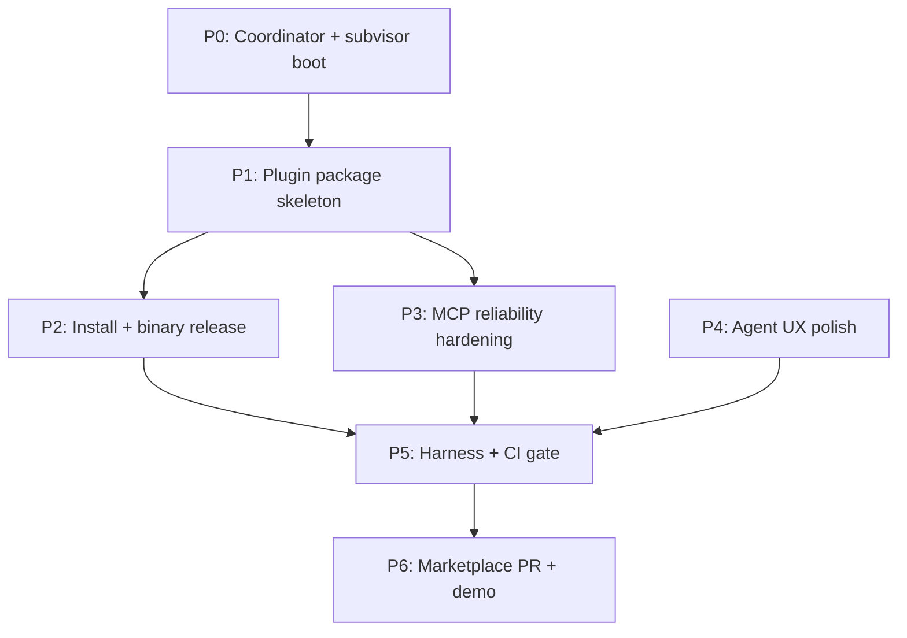

# Grok Build Marketplace Excellence Plan — Engram Geometric Memory

**Status:** Active (2026-06-11)  
**North star:** The most impressive memory plugin on the xAI marketplace — install in under 2 minutes, wake in under 2 seconds, handoff that actually works, zero doom loops.  
**Primary goal:** `goal:mvp_gap_closure_v1`  
**Arc:** `design:grok_marketplace_excellence_v1`  
**Owner:** Coordinator (main agent) + subvisor `agent:engram.monitor.subvisor`

---

## Success criteria (marketplace “wow” bar)

A cold user with **no prior Engram knowledge** must:

| # | Criterion | Measure |
|---|-----------|---------|
| S1 | Install from Marketplace tab | `grok plugin install` + `--trust` completes without manual MCP editing |
| S2 | First session works | Native `session_start` succeeds on first agent turn (<10s MCP spawn) |
| S3 | Continuity story | Second session rehydrates primary goal + last handoff without user paste |
| S4 | Code memory | `context_for_edit` returns file-scoped spatial + traces on a real edit |
| S5 | Lean safety | Default profile stays <500MB RSS on 100k+ store; no `watch_workspace` at wake |
| S6 | CI proof | `agent-memory` harness green on release tag |
| S7 | Differentiation | README/skill makes “not another vector DB” obvious in 30 seconds |
| S8 | xAI catalog | PR to `xai-org/plugin-marketplace` merged with pinned SHA |

**Beat competitors on:** structured handoff, CRS trust tiers, edit-scoped spatial, scars/traces, declarative process sheaf — not raw tool count.

---

## Competitive positioning (marketplace copy)

| Product | Weakness vs Engram |
|---------|-------------------|
| Grok native memory (`~/.grok/memory/*.md`) | Flat markdown; no code AABB; no goal/trace/scar model |
| Gentleman `engram` (Go/SQLite) | Flat FTS5; no geometric continuity or spatial edit context |
| mem0 / Letta | Cloud-centric vectors; no local sovereign `.leg3` blocks |
| RAG MCP wrappers | Retrieval without session handoff packets or lawfulness verify |

**Plugin name (marketplace):** `engram-geometric` (avoid collision with Go `engram`).  
**One-liner:** *Local geometric memory — one-call wake, anchor recall, edit-scoped code context, structured session handoff.*

---

## Phase DAG



| Phase | Deliverable | Owner role |
|-------|-------------|------------|
| **P0** | This plan + process toml + trace/tile | Coordinator |
| **P1** | `grok-plugin-engram/` valid `grok plugin validate` | Plugin Packager sub |
| **P2** | `install-engram-plugin.sh` + GitHub Release binary | Release Engineer sub |
| **P3** | Single canonical MCP launcher; lock hygiene | MCP Stability sub |
| **P4** | Skills, commands, comparison hero, live demo script | UX Storyteller sub |
| **P5** | CI `agent-memory` required; cold-store harness | Harness Gate sub |
| **P6** | marketplace.json entry + 90s demo video script | Marketplace Submit sub |

---

## Supervisor architecture

### S0 — Coordinator (main agent)

- Holds primary goal `goal:mvp_gap_closure_v1` and arc `design:grok_marketplace_excellence_v1`.
- Spawns narrow sub-agents only; never runs open-ended recon.
- After each sub: `quick_trace` + relate to goal; `thought_tile_create` at phase boundaries.
- Merges sub JSON reports; does not delegate merge to subs.
- Escalates to deep mode only for lawfulness audits.

### S1 — Subvisor (`agent:engram.monitor.subvisor`)

Loaded from `processes/monitor/subvisor.toml`. Enforces:

- **Max 20 tool calls** per sub-agent.
- **Kill on:** repeated `list_dir`/`grep`/`read` without progress (H¹ doom loop).
- **Kill on:** sub edits files outside declared scope.
- **Require:** sub returns structured JSON report as final message.
- **Scar immediately** on violation: `scar:*_subagent_loop`.

### S2 — Phase Supervisor (per-phase checklist)

Before marking a phase done, coordinator verifies:

```json
{
  "phase": "P1",
  "acceptance": ["grok plugin validate passes", "grok mcp doctor engram passes"],
  "build": "target/debug/engram --version",
  "traces": ["trace:*_phase_P1_complete"],
  "open_risks": []
}
```

---

## Sub-agent roster

Each sub gets a **narrow one-shot prompt**. Template:

```
PRIMARY OBJECTIVE: <single deliverable>
SCOPE: <exact paths only>
MCP FIRST: session_start(intent=...) if touching Engram behavior
MAX CALLS: 20
DO NOT: broad grep, explore unrelated crates, edit docs outside scope
REPORT: JSON { status, files_changed, commands_run, acceptance_met, blockers }
```

### SA-1 — Plugin Packager (P1)

| Field | Value |
|-------|-------|
| **Objective** | Complete `grok-plugin-engram/` so `grok plugin validate` passes |
| **Scope** | `grok-plugin-engram/**`, `scripts/install-engram-plugin.sh` |
| **Deliverables** | `plugin.json`, `.mcp.json`, `skills/`, `commands/`, `README.md`, `bin/engram-grok` |
| **Acceptance** | Local `grok plugin install ./grok-plugin-engram --trust` + `grok mcp doctor engram` |

### SA-2 — Release Engineer (P2)

| Field | Value |
|-------|-------|
| **Objective** | One-command install without `cargo build` for end users |
| **Scope** | `scripts/install-engram-plugin.sh`, `.github/workflows/release.yml` (new) |
| **Deliverables** | linux x86_64 release asset; optional macOS; install script puts `engram` + `engram-grok` on PATH |
| **Acceptance** | Fresh VM/dir: `./scripts/install-engram-plugin.sh` → `engram --version` → MCP doctor OK |

### SA-3 — MCP Stability Engineer (P3)

| Field | Value |
|-------|-------|
| **Objective** | Eliminate spawn failures (lock, timeout, double config) |
| **Scope** | `scripts/engram-grok`, `crates/engram-server/src/mcp_lock.rs`, `.grok/config.toml`, `grok-plugin-engram/.mcp.json` |
| **Deliverables** | Single canonical launcher; stale-lock doc; optional lock release on parent death |
| **Acceptance** | 10 consecutive TUI restarts without "Another engram MCP server"; startup <10s |

### SA-4 — UX Storyteller (P4)

| Field | Value |
|-------|-------|
| **Objective** | Marketplace-facing story + agent skills that teach 8-tool contract only |
| **Scope** | `grok-plugin-engram/skills/**`, `grok-plugin-engram/README.md`, `docs/GROK_BUILD_MEMORY.md` |
| **Deliverables** | Comparison table; `/engram-wake` command; 60-second quickstart |
| **Acceptance** | Non-technical reader understands value in README first screen |

### SA-5 — Harness Gate Engineer (P5)

| Field | Value |
|-------|-------|
| **Objective** | CI blocks merge if agent-memory path regresses |
| **Scope** | `.github/workflows/rust.yml`, `tools/test-harness/**` |
| **Deliverables** | Required `agent-memory` job on PR + release |
| **Acceptance** | `engram-harness.sh --suite agent-memory` exit 0 on ubuntu CI |

### SA-6 — Demo Producer (P4/P6)

| Field | Value |
|-------|-------|
| **Objective** | End-to-end demo script for marketplace listing |
| **Scope** | `docs/examples/marketplace_demo.md`, `examples/hello-engram-agent.py` (live MCP) |
| **Deliverables** | Session 1 remember + trace → session_end → Session 2 session_start rehydrate |
| **Acceptance** | Runnable in <5 min on clean store |

### SA-7 — Marketplace Submit (P6)

| Field | Value |
|-------|-------|
| **Objective** | xAI catalog PR |
| **Scope** | Fork `xai-org/plugin-marketplace`, `external_plugins/` or remote entry |
| **Deliverables** | `marketplace.json` entry with pinned SHA; keywords; category `development` |
| **Acceptance** | `validate-catalog.py` + `generate-plugin-index.py --check` pass upstream |

### SA-8 — Lawfulness Auditor (optional, deep mode)

| Field | Value |
|-------|-------|
| **Objective** | Pre-release `verify_manifold_integrity` sample on dogfood store |
| **Scope** | MCP tools only; no code edits unless CRS gate fails |
| **Deliverables** | JSON report min_crs, issues count |
| **Acceptance** | 0 critical issues; document known defer-BVH limitations |

---

## Execution order (this week)

### Day 1 — Foundation (started 2026-06-11)

- [x] Plan document (this file)
- [x] `grok-plugin-engram/` skeleton
- [x] `processes/meta/grok_marketplace_prep.toml`
- [ ] Coordinator: local `grok plugin install ./grok-plugin-engram --trust` test

### Day 2 — Install path

- [ ] SA-2: `install-engram-plugin.sh`
- [ ] SA-3: align `.grok/config.toml` with plugin `.mcp.json`
- [ ] SA-5: harness CI hard gate

### Day 3 — Polish

- [ ] SA-4: skills + README hero
- [ ] SA-6: live `hello-engram-agent.py` + demo doc
- [ ] SA-8: lawfulness sample

### Day 4 — Ship

- [ ] Tag `v0.5.1-plugin` (or `v0.6.0`)
- [ ] SA-7: marketplace PR
- [ ] Tile: `tile:formal_spec_grok-marketplace-plugin-shipped`

---

## Risk register

| Risk | Mitigation | Owner |
|------|------------|-------|
| CUDA build blocks install | Release prebuilt binary; CPU-only fallback in README | SA-2 |
| 10s Grok MCP timeout | Fast-placeholder path; no wait-ready in plugin default | SA-3 |
| MCP lock on restart | Kill stale process doc; optional atexit lock release | SA-3 |
| Name collision with Go engram | Brand `engram-geometric` everywhere | SA-4 |
| 62 tools overwhelm agents | Skills teach 8 only; tiers in MCP descriptions (Phase B) | SA-4 |
| Large store OOM | `ENGRAM_PROFILE=agent` only in plugin env | SA-3 |

---

## Files created by this arc

| Path | Purpose |
|------|---------|
| `design/GROK_MARKETPLACE_EXCELLENCE_PLAN.md` | This plan |
| `grok-plugin-engram/` | Installable Grok plugin |
| `processes/meta/grok_marketplace_prep.toml` | Process sheaf entry |
| `scripts/install-engram-plugin.sh` | End-user installer (SA-2) |

---

## Coordinator next actions

1. Run `grok plugin validate grok-plugin-engram/`
2. Spawn SA-2 (release) and SA-5 (harness) in parallel after local plugin test passes
3. Mint tile at P1 complete with validation output
4. Do **not** open marketplace PR until S6 (harness green on release binary)

*Dogfood: every phase boundary → `quick_trace` + relate to `goal:mvp_gap_closure_v1`.*