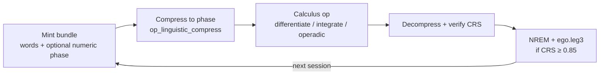

# Categorical Linguistic Calculus
## “Calculus over Words” — Synthetic Homotopy-Coherent Categorical Reasoning in Engram

Engram now supports native categorical reasoning directly over linguistic structures (words, discourse bundles, morphisms) and mixed with numeric phase tensors — all inside the same geometric sheaf as numbers and code ASTs. This is not bolted-on vector search; it is structure-preserving synthetic calculus (differentiate, integrate, operadic compose) with homotopy coherence, fibered class-mixing guards, and CRS Lyapunov stability, persisted via .leg3 + NREM/ego.leg3.

## Beginner-Friendly Walkthrough

**In one sentence:** You give Engram a bundle of words (each with a small coefficient vector), ask it to *differentiate* or *integrate* that bundle like calculus on language, optionally mix in numbers, and it returns a new bundle plus a CRS coherence score — all stored in the same geometric memory as your code and goals.

**Smallest example (differentiate one word):**

```json
mcp_linguistic_calculus({
  "operation": "differentiate",
  "bundle": {
    "bundle_id": "hello",
    "words": [{ "text": "hello", "coeff": [0.9, 0.1, 0, 0, 0, 0, 0, 0] }],
    "patches": []
  }
})
```

Returns something like `{ "crs": 0.87, "result": { "bundle_id": "hello", "word_count": 1 } }`. CRS ≥ 0.74 means the operation stayed lawful; ≥ 0.85 is required for NREM/ego.leg3 promotion.

**Memory lifecycle (word + number mixed):**



## Geometric and Sheaf Foundation
- Built on HolographicBlock (.leg3 256KB q-phase 8192D + p-momentum + CRS + BLAKE3 Merkle + AABB).
- VSA calculus (OP_ADD superpose, OP_BIND, OP_GEOMETRIC_PRODUCT for fibered gluing).
- Sheaf gluing from declarative processes/*.toml (category object/morphism, sheaf_role, h1_handler=OP_GEOMETRIC_PRODUCT for linguistic).
- Linguistic bundles encoded with coeff[8] scalars on phase; payload JSON for words/patches/functor_metadata (ZEDOS_LINGUISTIC* tags).
- Mixed bridging: words act as operators or scalars on numeric phases (and vice-versa) under fibered CRS >=0.74 guards (class-mixing scar on violation).
- Full pipeline survives compress → calc → decompress → NREM promotion to ego.leg3 with homotopy fidelity.

(See docs/GEOMETRIC_MEMORY.md for .leg3/VSA/sheaf; docs/RITUALS.md §Phase 5 for linguistic rituals.)

## P1–P6 Surface (Additive, No Core Invariant Changes)
- **P1 primitives**: mint_linguistic / extract_linguistic_bundle (types.rs: ZEDOS_LINGUISTIC=0x4C, ZEDOS_LINGUISTIC_POLY=0x4D, ZEDOS_FIBERED=0x4E; structs LinguisticWord {text, coeff[8]}, LinguisticContextPatch, LinguisticDiscourseBundle; Leg3Pointer mint/extract; tests roundtrip CRS preserve).
- **P2 sheaf**: linguistic-calculus.toml + fibered-equivalence.toml (processes/linguistic/; sheaf gluing, h1_handler OP_GEOMETRIC_PRODUCT, invariants CRS>=0.74, mcp_tools list); mcp.rs load includes "linguistic" subdir.
- **P3 ops**: compress/decompress/fibered_equiv (ops.rs linguistic functor ops; reuses VSA bind/geometric on coeffs + words; mint for ZEDOS payload).
- **P4 calculus**: mcp_linguistic_calculus (ops: differentiate/integrate/operadic_compose + mixed bridges op_mixed_linguistic_number_scale ~1348+, op_mixed_word_as_operator_on_num, op_mixed_num_param_on_linguistic + mixed_class_mixing_guard (fibered CRS guard)); mints ZEDOS_TRAINING; NREM relate.
- **P5 ritual**: ritual_linguistic_wake.toml + nrem-consolidation.toml edits (processes/ritual/; linguistic wake gluing, CRS0.85 gate, homotopy, ego.leg3 promotion, class-mixing scar); load at session_start.
- **P6 MCP**: full dispatch + load in mcp.rs (tool_list + handle); e2e tests in mcp.rs + ops.

## How to Use mcp_linguistic_calculus + Mixed Ops
(Examples assume agent with engram MCP wired; see docs/AGENT_MEMORY_CONTRACT.md for 8-tool contract. All ops under CRS Lyapunov + fibered guards.)

Example 1 — Basic linguistic differentiate (word bundle → derivative bundle + phase):
```
# (via mcp tool or direct)
result = mcp_linguistic_calculus({
  "bundle": {"words": [{"text": "hello", "coeff": [0.92, 0.1, 0.0, 0.0, 0.0, 0.0, 0.0, 0.0]}, {"text": "world", "coeff": [0.85, 0.2, ...]}], "bundle_id": "d1", "patches": []},
  "operation": "differentiate"
})
# returns {crs: 0.87, result_bundle: {...}, phase_preview: [...], ...}
```

Example 2 — Mixed word/number bridge (word coeff scalar * num phase via VSA; num param on linguistic):
Use ops or exposed mcp for mixed (op_mixed_* under the calculus surface). Guarded: mixed_class_mixing_guard enforces fibered CRS before apply.
```
# e.g. scale linguistic coeff by numeric phase factor (or word as operator shifting num param)
# craft LinguisticDiscourseBundle + numeric phase, apply bridges under guard
# result preserves .leg3 isomorphism, p-momentum, CRS >=0.74 (scar on class-mix violation)
```

Example 3 — Full roundtrip lifecycle with NREM:
mint mixed (linguistic + num via P1/P2) → P3 compress to phase → P4 calc (integrate or operadic on mixed) → decompress → ritual_linguistic_wake / NREM (promote high-CRS linguistic to ego.leg3) → verify CRS + homotopy text/coeff fidelity >=0.85.

See processes/linguistic/*.toml and ritual/ritual_linguistic_wake.toml for sheaf invariants (class-mixing scar, lyapunov). Mixed lifecycle test: mint mixed (phase1+2), P3 compress, P4 calc on mixed, decompress, NREM/ritual sim + ego mints, roundtrip CRS>=0.85 + fidelity + homotopy + class-mixing.

## Invariants / CRS Gates
- .leg3 isomorphism, CRS gate, allowed transforms only, unit hypersphere, p-tensor momentum preserved on update (no annihilate).
- Fibered class-mixing guard: CRS>=0.74 before mixed word/num apply (scar on violation).
- NREM/ego promotion: CRS 0.85+ for linguistic bundles + homotopy check (text/coeff fidelity).
- Full e2e + tests pass CRS gates; verify_manifold_integrity (min_crs 0.74) + spatial + genesis post changes.
- No core invariant changes; all additive (P1-6).

## How to Try the New Calculus (Public)
1. Build: `cargo build -p engram-server && target/debug/engram --version` (use target/debug exclusively).
2. Wire MCP (scripts/engram-grok or direct; restart IDE/TUI). See integrations/README.md.
3. `mcp_engram_session_start(intent="explore linguistic calculus")` (loads ritual/linguistic tomls).
4. Use `mcp_linguistic_calculus` + recall/remember/relate on results; or run `examples/hello-engram-agent.py` and extend with linguistic calls (see full e2e in crates/engram-core/src/ops.rs mixed tests + engram-server/src/mcp.rs).
5. For mixed: craft LinguisticDiscourseBundle + numeric phase, apply bridges under guard.
6. Verify: `mcp_engram_verify_manifold_integrity` (min_crs 0.74); check ego.leg3 promotion post-NREM sim. Run hygiene: cargo test -p engram-core -p engram-server, cargo check, target/debug/engram --version.

Full e2e + tests in crates/engram-core/src/ops.rs (mixed tests) + engram-server/src/mcp.rs.

This advances Engram from geometric memory to geometric *reasoning* substrate — calculus over the manifold itself. Public polish (Phase 6) complete per GITHUB_MVP_PREP_PLAN.md; ready for sharing.

**Links:**
- [docs/RITUALS.md](docs/RITUALS.md) (Phase 5 linguistic rituals)
- [docs/MCP_TOOLS_REFERENCE.md](docs/MCP_TOOLS_REFERENCE.md) (mcp_linguistic_calculus + P1-P6 surface)
- [docs/GEOMETRIC_MEMORY.md](docs/GEOMETRIC_MEMORY.md)
- [docs/GITHUB_MVP_PREP_PLAN.md](docs/GITHUB_MVP_PREP_PLAN.md)
- [docs/AGENT_MEMORY_CONTRACT.md](docs/AGENT_MEMORY_CONTRACT.md)
- [AGENTS.md](AGENTS.md), [CLAUDE.md](CLAUDE.md)
- processes/linguistic/*.toml, processes/ritual/ritual_linguistic_wake.toml
