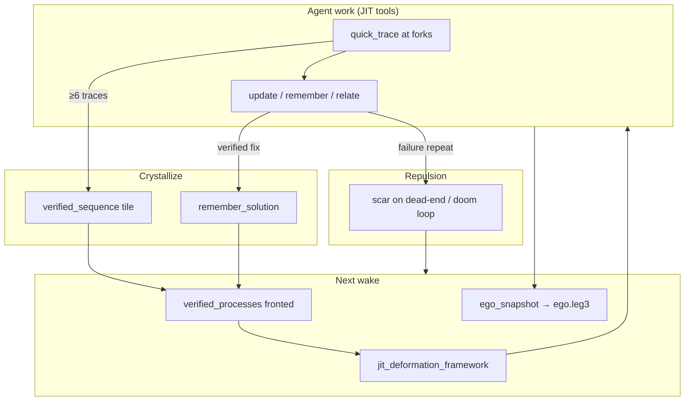

# Deformation Playbooks — JIT Homotopy for Agents

**Audience:** AI agents (primary end user) and harness authors  
**Companion:** [HARNESS_INJECTION.md](HARNESS_INJECTION.md), [TOOL_DECISION_MAP.md](TOOL_DECISION_MAP.md), [docs/schemas/verified_sequence_v0.json](schemas/verified_sequence_v0.json)

Agents deform `.leg3` blocks lawfully (q/p/CRS/AABB/relations). This doc defines **how wake injection suggests work without scripting it** — JIT tool construction as context requires, with **scar repulsion** and **verified tiles** as RSI continuity carriers.

---

## Core principle: hints, not scripts

| Layer | Role |
|-------|------|
| `suggested_actions` | Priority queue of **starting points** — handoff, goal, files, scars |
| `jit_deformation_framework` | Task-type **phases** + tool **palette** — agent picks and constructs args |
| `verified_processes` | CRS ≥0.85 tiles fronted at wake — **verified_sequence** step previews + `tool_hints` |
| `agent_discipline` | When to scar, crystallize, condense, trace |

**Mandate (injected at wake):** suggested actions and verified processes are hints. Construct MCP calls JIT from current file, goal, atlas, and trace head. Do not blind-replay args from prior sessions.

---

## Task types

`session_start` / `get_continuation_bundle` set `harness_injection.task_type`:

| Type | Signal | JIT focus |
|------|--------|-----------|
| `wake_only` | Thin handoff | Rehydrate goal + trace head |
| `code_edit` | `files_touched` in handoff | `safe_edit_and_verify` (preferred) or `context_for_edit` → trace → `update_with_tensor_bond(__arc)` |
| `meta_evolution` | Meta intent or `condensation_hints` | `draft_from_chain` → `thought_tile_create` |
| `research` | Research intent | `scout` / recall → `research_offload` tile |
| `recovery` | `open_scars_wake` non-empty | Read scar → falsifiable trace → scar on repeat |

Full phase palettes live in `harness_injection.jit_deformation_framework.phases[]`.

---

## RSI loop: scar, evolve, condense, front

| Event | Tool | Effect on manifold |
|-------|------|-------------------|
| Dead-end / repetition | `mcp_engram_scar` | Repulsion geometry — wake surfaces `open_scars_wake` |
| Verified fix | `mcp_engram_remember_solution` | Pinned praxis (CRS 1.0) |
| Long trace arc | `thought_tile_create` (`verified_sequence_v0`) | Condensed homotopy playbook |
| Next wake | `verified_processes` | Tile fronted with `steps_preview` + `tool_hints` |
| Background | NREM → `ego.leg3` | Identity centroid from high-CRS contributors |

Process anchor: `process:engram.meta.agent-evolution` (composed wake → work → handoff → NREM).

---

## Verified processes in tiles

`verified_sequence_v0` tiles are **fronted verified processes** — not macros.

**At wake:** `harness_injection.verified_processes[]` includes:

- `tile` — concept name
- `steps_preview` — order, decision, why, `tool_hints`
- `jit_replay` — how to adapt steps to current context
- `on_full_success` → `remember_solution`
- `on_repeat_failure` → `scar`

**Agent replay (JIT):**

1. `read_concept(tile)` — load payload
2. For each step (by `order`): use `tool_hints` + `args_hints` as **suggestions** (auto-populated from source trace `spatial_context` at condensation time)
3. Resolve `spatial_context` → absolute path + `recall_in_file` window; construct `context_for_edit` / `update(__arc)` args JIT
4. `quick_trace` outcomes with `prev` chain
5. On full success: `remember_solution`; on repeat failure: `scar`

`draft_tile_from_chain` / `thought_tile_draft_from_chain` infer `tool_hints` from each trace's `spatial_context`, goal, and decision text (edit → context_for_edit/recall_in_file/update; scar language → scar; verify → lawfulness tools).

See `/engram-execute-tile` in the Grok plugin and [verified_sequence_v0.json](schemas/verified_sequence_v0.json).

`state_machine`, `formal_spec`, and `research_offload` tiles are fronted similarly with branch-following `jit_replay` text.

---

## JIT vs lean 8-tool contract

| Mode | When |
|------|------|
| **Lean 8** | Default highway — wake, edit prep, recall, trace, remember, handoff |
| **JIT palette** | Escalate tools from `jit_deformation_framework` when phase `when` matches context |
| **Verified tile** | When `verified_processes` matches the current arc — prefer tile over re-deriving |

Escalation examples (construct args JIT):

- `query_with_momentum` — directional recall when anchors thin
- `search_by_relation` — graph neighborhood from seed concept
- `verify_manifold_integrity` — before merge / large refactor
- `process_metrics` — meta evolution friction on `process:engram.*`

---

## Homotopy invariants (never violate)

- `update` preferred over `forget` + `remember`
- CRS ≥ 0.74 for grounded work
- p-momentum preserved on update
- Chain `quick_trace` via `prev`
- Spatial: `context_for_edit` before edits; `update(__arc)` after

---

## Implementation

| Component | Path |
|-----------|------|
| JIT framework builder | `crates/engram-server/src/harness_injection.rs` |
| Slim wake fields | `task_type`, `jit_mandate`, `verified_process_count` in `wake_bundle.rs` |
| Process spec | `processes/harness/jit-deformation.toml` |
| Tool matrix | `tools/test-harness/python/mcp_tool_matrix.py` |

---

## Related

- [HARNESS_INJECTION.md](HARNESS_INJECTION.md) — wake queue, continuity playbook
- [CODE_ATLAS_CONTINUITY.md](CODE_ATLAS_CONTINUITY.md) — `__arc` deformation on code
- [SUBSTRATE_WINS_PLAN.md](SUBSTRATE_WINS_PLAN.md) — historical WS-2/WS-4 verified_sequence program