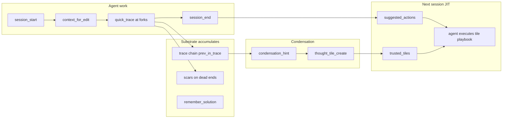

# Harness Injection — Traces → Tiles → JIT Playbooks

**Audience:** Agent harness authors (Grok Build, Cursor, Claude) + substrate maintainers  
**Companion:** [TOOL_DECISION_MAP.md](TOOL_DECISION_MAP.md), [AGENT_MEMORY_CONTRACT.md](AGENT_MEMORY_CONTRACT.md)

The AI agent is the **primary user**. Harness injection pushes geometric context into the agent loop without requiring discipline alone.

---

## The learning pipeline

| Stage | Artifact | Purpose |
|-------|----------|---------|
| Fork | `trace:*` + `prev` chain | Train of thought over time |
| Dead end | `scar:*` | Repulsion — don't repeat |
| Verified fix | `praxis` via `remember_solution` | Trusted replay |
| Many traces, no tile | `condensation_hint` | Prompt tile creation |
| Meta arc | `tile:*` (state_machine, verified_sequence) | Condensed decision tree |
| Next wake | `suggested_actions` + `trusted_tiles` | Machine queue for agent |

---

## What `session_start` injects

`continuation_bundle.harness_injection`:

| Field | Content |
|-------|---------|
| `suggested_actions` | Ordered MCP queue: sentinel nudge (if due) → read `manifest:rehydration_*` → read handoff → recall goal → `context_for_edit` on files touched → chain `quick_trace` from trace head → read trusted tiles |
| `trusted_tiles` | CRS ≥0.85 tiles (`verified_sequence`, `state_machine`, `formal_spec`, `research_offload`) linked to goal or handoff |
| `rehydration_manifest` | Compact portable kit from last `session_end` (`primary_goal`, `trace_chain_head`, trusted tile refs, hub anchors, `files_touched`) — priority-0 wake seed |
| `rehydrate_suggested` | Soft sentinel flag (~30 turns / ~120 min) — nudge-only; counters in `ego_snapshot` |
| `uncertainty_receipts_wake` | Recent `uncertainty:*` blocks for withheld memory claims |
| `trace_chain` | Head + backward walk via `prev_in_trace` relations (up to 8) |
| `ego_snapshot` | Readable agent evolution: NREM step, `drift_velocity`, stability, last pass age, top 3 goal-serving concepts + sentinel counters |
| `continuity_playbook` | 12-step ordered narrative (wake → edit → fork → handoff → identity/NREM) with doc refs |
| `presentation_stratum` | Distilled K-node process/ritual continuation (CRS-ranked, lineage-attached); cold 187k excluded |
| `condensation_hints` | When ≥6 traces without goal-linked tile → suggest `thought_tile_create` |
| `agent_discipline` | Fork → trace; meta boundary → tile; persist → update/remember; **`queue_before_edits` mandatory** |

**Harness rule:** Execute `suggested_actions` before broad `Read`/`Grep` on Engram work.

**Slim wake (default):** `suggested_actions`, `injection_completeness`, and `nvme_context` are hoisted to `continuation` root — not nested under `harness_injection`. Full nested payload: `mcp_engram_get_continuation_bundle`.

### Manage resume (TUI / MCP restart)

| Step | Tool / action | Pass criterion |
|------|---------------|----------------|
| 1 | Restart TUI / MCP after substrate build | `mcp_engram_*` tools available |
| 2 | `session_start(intent="post-restart verify")` | `continuation.injection_completeness.score` present; `continuation.nvme_context.recall_mode` present |
| 3 | Execute `suggested_actions` → `ack_wake_queue` | `injection_rank` on queue items; gate clears |
| 4 | Poll `get_backend_readiness` (~30s on large store) | `fully_initialized:true`; target `recall_mode=full_bvh_gpu` when BVH completes |
| 5 | Escalate if incomplete | `get_continuation_bundle` when `missing` contains `nvme_recall_path` |

**Harness without TUI:** `STABLE_BIN=target/debug/engram tools/test-harness/bin/engram-harness.sh --suite agent-memory` — new MCP client per run simulates restart; asserts `injection_completeness.score`, `nvme_context.recall_mode`, `suggested_actions[0].injection_rank`.

**Agent tool fidelity (post tensor MVP #47):** `STABLE_BIN=target/debug/engram tools/test-harness/bin/engram-harness.sh --suite agent-tool-fidelity --workspace /path/to/Engram --scratch /tmp/grok-goal-XXX/implementer --record-results` — runs **2 consecutive** clean suites, overwrites six SCRATCH artifacts (`fidelity_harness.json` with `suite_result`, `agent_tool_fidelity_harness.log`, `fidelity_demo.log`, `composite_tool_evidence.txt`, `fidelity_diagnosis_source.txt`, `ritual_toml_evidence.txt`). Asserts `fidelity_rate=1.0`, `prev_in_trace chain verified`, misuse scar + `failure_pattern`. AC1 doc drift gated by `cargo test -p engram-server fidelity_few_shots_docs_match_canonical`. After substrate changes: restart MCP (`scripts/install-engram-plugin.sh` or new Grok session).

**Tensor-thought unification (post #48):** `STABLE_BIN=target/debug/engram tools/test-harness/bin/engram-harness.sh --suite tensor-thought-unification --scratch /tmp/grok-goal-XXX/implementer` — **2 consecutive** runs: `thought_tile_create` → `tensor:tile__` mirror (CRS ≥ 0.74, bonds) → `update_with_tensor_bond` on tile → `write_result` → `session_end` consolidation → wake `tensor_recall` lineage → `propose_improvement`. SCRATCH: `unification_mapping.txt`, `tile_to_tensor_evidence.txt`, `consolidation_wake_evidence.txt`, `propose_improvement_evidence.txt`, `tensor_thought_unification_harness.log/json`. `agent_discipline.tensor_unification_rituals` lists `ritual:thought_tile_to_tensor` + `ritual:verified_update_with_consolidation`.

| 6 | Goal complete — clear injection | `goal_update_status(completed)` + `demote_from_context` on task goal; TUI `/goal` → `update_goal(completed=true)` |
| 7 | Terminal — push notes | Commit + PR describing fixes/improvements (traces, ACs, branch); see `{SCRATCH}/pr-notes.md` in harness runs |

### Wake queue gate (low-friction enforcement)

| `ENGRAM_WAKE_QUEUE_GATE` | Behavior |
|--------------------------|----------|
| `hard` (**agent profile default**) | `context_for_edit` returns 403 until `mcp_engram_ack_wake_queue` |
| `soft` | `context_for_edit` succeeds with `wake_queue_gate.warning` until ack |
| `off` | Disabled (CI / dev) |

**Flow:** `session_start` → execute `suggested_actions` → `mcp_engram_ack_wake_queue(executed=true)` → `context_for_edit`.

Empty queue **auto-acks** at `session_start` (zero friction on fresh stores).

Violations log to `activity_feed.jsonl` → LEG hygiene `wake_queue_debt`. Optional scars: `ENGRAM_WAKE_QUEUE_SCAR=5` in hard mode only.

### Edit-arc gate (post-edit ritual enforcement)

| `ENGRAM_EDIT_ARC_GATE` | Behavior |
|------------------------|----------|
| `soft` (agent profile default) | Repeat `context_for_edit` on same path warns until `__arc` updated or acked |
| `hard` | Blocks repeat `context_for_edit` on same locus until `mcp_engram_update` on `__arc` or `mcp_engram_ack_edit_arc` |
| `off` | Disabled |

**Preferred post-edit:** `update("{stem}__fn__{name}__arc", "delta: …")` using args from `post_edit_palette`. **Read-only recon:** `ack_edit_arc(skip=true, note="read-only pass")`.

`edit_arc_debt` appears in atlas JSON and LEG hygiene when arcs are pending.

---

## What `context_for_edit` injects

Per-file `harness_injection`:

| Field | Content |
|-------|---------|
| `last_session_touched` | File appeared in last `session_end` handoff |
| `open_scars` | Scar concepts matching module stem |
| `suggested_actions` | `quick_trace` before edit if continued file; read scar if present |
| `post_edit_palette` | Concrete `mcp_engram_update` queue on `__arc` concepts when `spatial_items` present |
| `at_edit_mandatory` | Reminder to trace after substantive change |

---

## Decision trees over time

Traces form a **custom decision tree** per arc:

- Nodes = `trace:*` blocks (decision, why, alternatives)
- Edges = `prev_in_trace` / `next_in_trace`
- Goal anchor = `serves` relation to `goal:*`
- Tiles = **condensed subtrees** — state_machine payloads encode branches agents can replay

When the same problem class recurs:

1. Wake surfaces `trusted_tiles` in `suggested_actions`
2. Agent `read_concept` on tile → executes known-good sequence
3. New forks append to chain via `quick_trace` with `prev`
4. Subvisor/monitor processes (from `processes/*.toml`) provide H¹ oversight on tool graphs

---

## Agent obligations (still required)

Injection **reduces friction**; it does not replace:

| Moment | Tool / command |
|--------|----------------|
| Every fork | `/engram-trace` — chain `prev` from `trace_chain.head` |
| Meta boundary | `/engram-tile` when `condensation_hints` non-empty |
| Refine memory | `/engram-update` not duplicate remember |
| End block | `/engram-session-end` with files + trace ids in summary |

Low-fidelity handoffs produce thin `suggested_actions` — the substrate feeds back poor injection when agents skip `session_end`.

---

## Implementation

- `crates/engram-server/src/harness_injection.rs` — build suggested_actions, trace chain, tiles, file injection
- `store.rs` — `build_continuation_bundle`, `context_for_edit` embed `harness_injection`
- Plugin slash commands — [grok-plugin-engram/commands/README.md](../grok-plugin-engram/commands/README.md)

---

## Program history (shipped)

The harness injection learning loop (Cursor auto-wake, auto-tile draft, process metrics, `verified_sequence` schema) is **implemented**. Historical design record: **[SUBSTRATE_WINS_PLAN.md](SUBSTRATE_WINS_PLAN.md)**. **Current ops:** this doc + **[DEFORMATION_PLAYBOOKS.md](DEFORMATION_PLAYBOOKS.md)**.

---

## JIT deformation (agents construct tool calls as context requires)

Wake injection is **not** a fixed script. See **[DEFORMATION_PLAYBOOKS.md](DEFORMATION_PLAYBOOKS.md)** for the full spec.

| Field | Purpose |
|-------|---------|
| `task_type` | `code_edit` \| `meta_evolution` \| `research` \| `recovery` \| `wake_only` |
| `jit_deformation_framework` | Phase palettes — mandatory vs JIT tools; homotopy invariants |
| `verified_processes` | Trusted tiles fronted at wake (`verified_sequence` step previews + `tool_hints`) |
| `open_scars_wake` | Repulsion hints — read before repeating dead paths |
| `jit` on `suggested_actions` | `construct_args_from_context: true` — adapt args, do not blind-replay |

**RSI:** scar → repulsion; `remember_solution` + successful tile replay → crystallize; condensation → tile → next wake `verified_processes`; NREM → `ego.leg3`.

---

## Related

- [DEFORMATION_PLAYBOOKS.md](DEFORMATION_PLAYBOOKS.md) — JIT homotopy + verified tiles + RSI
- [SUBSTRATE_WINS_PLAN.md](SUBSTRATE_WINS_PLAN.md) — historical program record (shipped)
- [RITUALS.md](RITUALS.md) — thought tiles mandatory for meta
- [docs/skills/engram-thought-tiles.md](skills/engram-thought-tiles.md)
- `processes/monitor/subvisor.toml` — doom loop / meta escalation