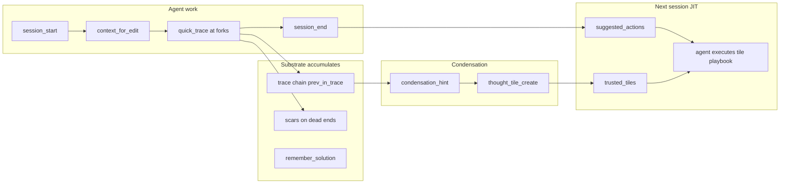

# Harness Injection — Traces → Tiles → JIT Playbooks

**Audience:** Agent harness authors (Grok Build, Cursor, Claude) + substrate maintainers  
**Companion:** [TOOL_DECISION_MAP.md](TOOL_DECISION_MAP.md), [AGENT_MEMORY_CONTRACT.md](AGENT_MEMORY_CONTRACT.md)

The AI agent is the **primary user**. Harness injection pushes geometric context into the agent loop without requiring discipline alone.

---

## The learning pipeline

| Stage | Artifact | Purpose |
|-------|----------|---------|
| Fork | `trace:*` + `prev` chain | Train of thought over time |
| Dead end | `scar:*` | Repulsion — don't repeat |
| Verified fix | `praxis` via `remember_solution` | Trusted replay |
| Many traces, no tile | `condensation_hint` | Prompt tile creation |
| Meta arc | `tile:*` (state_machine, verified_sequence) | Condensed decision tree |
| Next wake | `suggested_actions` + `trusted_tiles` | Machine queue for agent |

---

## What `session_start` injects

`continuation_bundle.harness_injection`:

| Field | Content |
|-------|---------|
| `suggested_actions` | Ordered MCP queue: read handoff → recall goal → `context_for_edit` on files touched → chain `quick_trace` from trace head → read trusted tiles |
| `trusted_tiles` | CRS ≥0.85 tiles (`verified_sequence`, `state_machine`, `formal_spec`, `research_offload`) linked to goal or handoff |
| `trace_chain` | Head + backward walk via `prev_in_trace` relations (up to 8) |
| `condensation_hints` | When ≥6 traces without goal-linked tile → suggest `thought_tile_create` |
| `agent_discipline` | Fork → trace; meta boundary → tile; persist → update/remember; pipeline summary |

**Harness rule:** Execute `suggested_actions` before broad `Read`/`Grep` on Engram work.

---

## What `context_for_edit` injects

Per-file `harness_injection`:

| Field | Content |
|-------|---------|
| `last_session_touched` | File appeared in last `session_end` handoff |
| `open_scars` | Scar concepts matching module stem |
| `suggested_actions` | `quick_trace` before edit if continued file; read scar if present |
| `at_edit_mandatory` | Reminder to trace after substantive change |

---

## Decision trees over time

Traces form a **custom decision tree** per arc:

- Nodes = `trace:*` blocks (decision, why, alternatives)
- Edges = `prev_in_trace` / `next_in_trace`
- Goal anchor = `serves` relation to `goal:*`
- Tiles = **condensed subtrees** — state_machine payloads encode branches agents can replay

When the same problem class recurs:

1. Wake surfaces `trusted_tiles` in `suggested_actions`
2. Agent `read_concept` on tile → executes known-good sequence
3. New forks append to chain via `quick_trace` with `prev`
4. Subvisor/monitor processes (from `processes/*.toml`) provide H¹ oversight on tool graphs

---

## Agent obligations (still required)

Injection **reduces friction**; it does not replace:

| Moment | Tool / command |
|--------|----------------|
| Every fork | `/engram-trace` — chain `prev` from `trace_chain.head` |
| Meta boundary | `/engram-tile` when `condensation_hints` non-empty |
| Refine memory | `/engram-update` not duplicate remember |
| End block | `/engram-session-end` with files + trace ids in summary |

Low-fidelity handoffs produce thin `suggested_actions` — the substrate feeds back poor injection when agents skip `session_end`.

---

## Implementation

- `crates/engram-server/src/harness_injection.rs` — build suggested_actions, trace chain, tiles, file injection
- `store.rs` — `build_continuation_bundle`, `context_for_edit` embed `harness_injection`
- Plugin slash commands — [grok-plugin-engram/commands/README.md](../grok-plugin-engram/commands/README.md)

---

## Related

- [RITUALS.md](RITUALS.md) — thought tiles mandatory for meta
- [docs/skills/engram-thought-tiles.md](skills/engram-thought-tiles.md)
- `processes/monitor/subvisor.toml` — doom loop / meta escalation