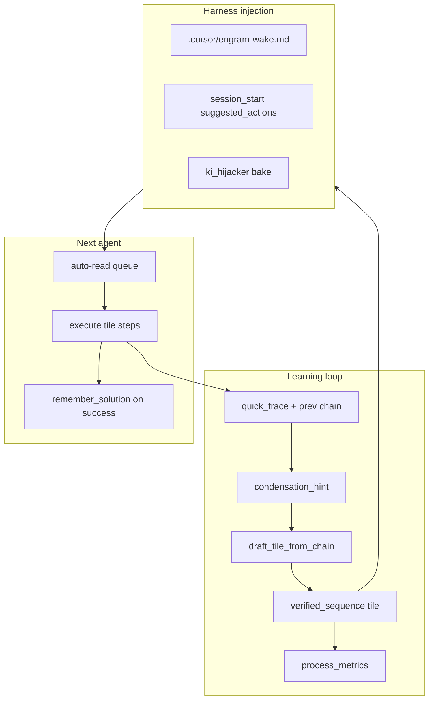
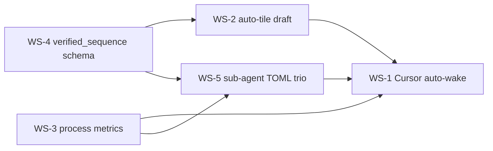
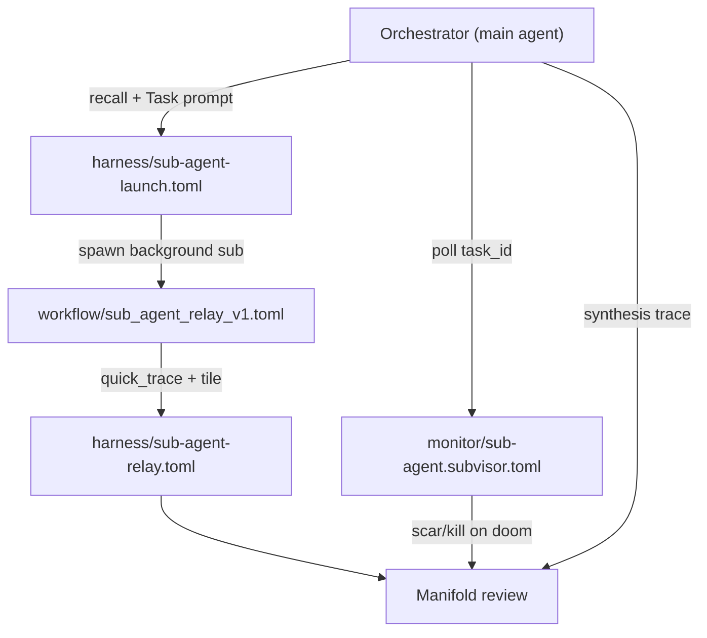

# Substrate Wins Plan — Harness Injection & Learning Loop

**Status:** Implemented (2026-06-11) — WS-4/2/3/5 runtime + WS-1 Cursor bundle
**Goal:** `goal:mvp_gap_closure_v1`  
**Depends on:** [HARNESS_INJECTION.md](HARNESS_INJECTION.md) (shipped `1c80f77e`), [TOOL_DECISION_MAP.md](TOOL_DECISION_MAP.md)

Close the gap between **trace accumulation** and **JIT trusted playbooks** — with Cursor/Grok harnesses injecting context before turn 1.

---

## North star



| Win | Outcome |
|-----|---------|
| **WS-1** Cursor auto-wake | Agent sees `suggested_actions` before turn 1 without calling MCP first |
| **WS-2** Auto-tile draft | `condensation_hint` includes machine-ready payload + optional one-click mint |
| **WS-3** Process metrics | Per `process:engram.*` trace/tile/praxis fulfillment ratios |
| **WS-4** `verified_sequence` | Typed step schema agents execute mechanically |
| **WS-5** Sub-agent TOML trio | Launch harness + relay harness/workflow + monitor subvisor — orchestrator can spawn, poll, and review geometrically |

---

## Workstream dependency DAG



**Recommended order:** WS-4 → WS-2 → WS-3 (parallel with WS-2 tail) → WS-5 → WS-1

---

## WS-1 — Cursor auto-wake (inject before turn 1)

### Problem

`harness_injection.suggested_actions` exists in `session_start` JSON but Cursor agents only see it **after** they invoke MCP. `ki_hijacker` bakes to Antigravity paths, not `.cursor/`.

### Phases

#### Phase 1A — Rules & MCP alignment (1 PR, no Rust)

| Task | File | Change |
|------|------|--------|
| Lean turn-1 contract | `.cursor/rules/engram.md` (new) | Mandate: read `.cursor/engram-wake.md` if present → else `session_start` → execute `suggested_actions` |
| Fix stale rules | `.cursorrules` | Remove `watch_workspace` at wake; point to `session_start` + `suggested_actions` |
| Align clinerules | `.clinerules` | Same lean contract |
| Public wake skill | `docs/skills/engram-wake-up.md` | Document `harness_injection` execution |
| MCP schema fix | `crates/engram-server/src/mcp.rs` | Demote `watch_workspace` "MANDATORY"; elevate `session_start` + `harness_injection` in tool descriptions |

**Acceptance:** New Cursor session with rules loaded; agent contract text references `suggested_actions` and not `watch_workspace` at wake.

#### Phase 1B — Committed Cursor bundle (1 PR)

| Task | File | Change |
|------|------|--------|
| MCP config | `.cursor/mcp.json` | Copy from `integrations/cursor/mcp.json` + `ENGRAM_KI_ARTIFACTS_DIR=${workspaceFolder}/.cursor/engram-ki` |
| Integration doc | `integrations/cursor/README.md` | Install + wake injection story |

#### Phase 1C — Ambient wake file (1 PR, Rust + script)

| Task | File | Change |
|------|------|--------|
| Prompt formatter | `harness_injection.rs` | `format_suggested_actions_markdown()` → human queue |
| KI path | `ki_hijacker.rs` | If `ENGRAM_KI_ARTIFACTS_DIR` contains `.cursor`, also write `engram-wake.md` |
| Preflight script | `scripts/cursor-engram-preflight.sh` | One-shot: spawn/wait-ready → REST or MCP `session_start` → write `.cursor/engram-wake.md` |
| Hook doc | `integrations/cursor/README.md` | Optional: run preflight on workspace open (Cursor task / manual) |

**Acceptance:**
- After preflight or KI bake, `.cursor/engram-wake.md` lists prioritized actions from last handoff
- File regenerates when `session_end` updates `helper:session_handoff_latest`
- Harness: extend `tools/test-harness/python/mcp_test_client.py` — `session_start` → assert `harness_injection.suggested_actions` non-empty after seeded handoff

#### Phase 1D — Grok parity (small)

| Task | File | Change |
|------|------|--------|
| Plugin | `grok-plugin-engram/plugin.json` | Document auto-wake via `/engram-wake` step 3 (already partial) |

### Verification gate WS-1

```bash
cargo build -p engram-server
STABLE_BIN=target/debug/engram tools/test-harness/bin/engram-harness.sh --suite agent-memory
./scripts/cursor-engram-preflight.sh && test -f .cursor/engram-wake.md
```

---

## WS-2 — Auto-tile on condensation

### Problem

`build_condensation_hints` fires at ≥6 traces without goal-linked tile but only suggests `state_machine` with empty payload. No draft, no provenance edges.

### Phases

#### Phase 2A — Trace chain parser (1 PR)

| Task | File | Change |
|------|------|--------|
| Parse trace bodies | `harness_injection.rs` or new `tile_draft.rs` | Extract `decision_point`, `justification`, `alternatives`, `falsifiability` from ProvLog |
| Chain tip | `harness_injection.rs` | Resolve head via `next_in_trace` forward walk from oldest in goal-serving set, not just `access_index.recent` |
| Goal-filtered count | `build_condensation_hints` | Count only `trace:*` with `serves` → primary goal |

#### Phase 2B — Draft payload in hints (1 PR)

| Task | File | Change |
|------|------|--------|
| Draft builder | `tile_draft.rs` | `draft_tile_from_chain(store, head, goal) -> Value` |
| Hint enrichment | `build_condensation_hints` | Add `draft_payload`, `draft_title`, `recommended_tile_type` |
| Types | Logic | ≥4 linear steps → `verified_sequence`; branching → `state_machine` |

**Draft `verified_sequence` shape (v0):**

```json
{
  "version": "verified_sequence_v0",
  "goal_context": "goal:mvp_gap_closure_v1",
  "source_traces": ["trace:...", "..."],
  "steps": [
    {
      "order": 1,
      "trace_id": "trace:1781202155_...",
      "decision": "Implement harness_injection",
      "why": "...",
      "tool_hints": ["mcp_engram_context_for_edit"],
      "outcome": "shipped"
    }
  ],
  "invariants": ["no forget+remember", "CRS>=0.74"],
  "replay_contract": "Execute steps in order; quick_trace new forks with prev=last step trace_id"
}
```

#### Phase 2C — MCP tool (1 PR)

| Task | File | Change |
|------|------|--------|
| New tool | `mcp.rs` | `mcp_engram_thought_tile_draft_from_chain` — returns draft only (no mint) |
| Extend create | `thought_tile_create` | Accept `draft_from_hint: true` + validate payload against tile_type schema |
| Slash command | `grok-plugin-engram/commands/engram-tile-draft.md` | `/engram-tile-draft` |

#### Phase 2D — Provenance relations (1 PR)

On `thought_tile_create` when `spatial_references` includes trace IDs:

| Relation | Meaning |
|----------|---------|
| `compresses_chain_from` | tile → trace (each source) |
| `realized_by` | trace → `process:engram.*` (if `process_context` set) |
| `serves` | tile → goal (existing) |

**Acceptance:**
- Unit: `draft_tile_from_chain` on fixture traces produces valid `verified_sequence_v0`
- Integration: condensation hint includes `draft_payload`; agent calls `thought_tile_create` with copy-paste
- Harness: seed 6 traces → `session_start` → hint has `draft_payload.steps.len() >= 3`

### Verification gate WS-2

```bash
cargo test -p engram-server tile_draft condensation
# mcp_test_client: seed traces → session_start → assert draft_payload present
```

---

## WS-3 — Process success metrics

### Problem

`process:engram.*` TOMLs declare `[produces]` wildcards (`trace:*_subvisor_enforce`) but no runtime `realized_by` edges. `mcp_engram_stats` is manifold-wide only.

### Phases

#### Phase 3A — `realized_by` at emission (1 PR)

Add optional `process_context` to:

| Tool | Relation on success |
|------|---------------------|
| `quick_trace` / `record_reasoning_trace` | `trace → process_context` label `realized_by` |
| `thought_tile_create` | `tile → process_context` |
| `scar` | `scar → process_context` |
| `remember_solution` | `praxis → process_context` |

**Files:** `mcp.rs` handlers, `docs/MCP_TOOLS_REFERENCE.md`, slash commands `/engram-trace`, `/engram-tile`

#### Phase 3B — `mcp_engram_process_metrics` (1 PR)

| Task | File | Change |
|------|------|--------|
| Module | `crates/engram-server/src/process_metrics.rs` | Parse sheaf TOMLs, glob-match produces, graph counts |
| MCP | `mcp.rs` | Register tool in `tool_list` + dispatch |
| Docs | `MCP_TOOLS_REFERENCE.md`, `TOOL_DECISION_MAP.md` | Power tier |

**Output schema:**

```json
{
  "process_key": "process:engram.monitor.subvisor",
  "toml": "processes/monitor/subvisor.toml",
  "declared_produces": ["trace:*_subvisor_enforce", "scar:*_subagent_loop"],
  "outcomes": {
    "trace": { "count": 12, "by_pattern": { "trace:*_subvisor_enforce": 3 } },
    "tile": { "count": 2 },
    "praxis": { "count": 1 },
    "scar": { "count": 5 }
  },
  "realized_by_count": 8,
  "fulfillment_ratio": 0.42
}
```

**Counting strategy (dual):**
1. **Graph:** `search_by_relation(process, "realized_by", "from")`
2. **Pattern:** glob match `list_concepts` against `[produces].list`

#### Phase 3C — Dashboard hook (optional)

| Task | File | Change |
|------|------|--------|
| REST | `serve.rs` | `GET /api/process-metrics` proxy |
| LEG browser | `tools/leg-browser/` | Process fulfillment panel |

### Verification gate WS-3

```bash
cargo test -p engram-server process_metrics
# quick_trace with process_context=process:engram.monitor.subvisor
# process_metrics → realized_by_count >= 1
```

---

## WS-4 — `verified_sequence` tile type (schema + execution)

### Problem

`verified_sequence` is a string in MCP docs and gets `ZEDOS_PRAXIS`, but no payload validation or mechanical replay contract.

### Phases

#### Phase 4A — Schema & validation (1 PR)

| Task | File | Change |
|------|------|--------|
| Schema doc | `docs/schemas/verified_sequence_v0.json` | JSON Schema |
| Validator | `tile_draft.rs` or `store.rs` | Validate on `thought_tile_create` when `tile_type == "verified_sequence"` |
| Skills | `docs/skills/engram-thought-tiles.md`, `engram-tile.md` | Document type + replay rules |

**Required fields:** `version`, `steps[]` with `order`, `decision`, `why`; optional `tool_hints`, `trace_id`, `outcome`

#### Phase 4B — Trusted tile promotion (1 PR)

| Task | File | Change |
|------|------|--------|
| `build_trusted_tiles` | `harness_injection.rs` | Prefer `verified_sequence` over `state_machine` when both qualify |
| `suggested_actions` | Same | Add `execute_verified_sequence: true` flag on trusted step tiles |

#### Phase 4C — Agent execution contract (1 PR, docs + plugin)

| Task | File | Change |
|------|------|--------|
| Slash | `grok-plugin-engram/commands/engram-execute-tile.md` | `/engram-execute-tile <concept>` — read tile, run steps, trace each fork |
| Harness injection | `format_suggested_actions_markdown` | For `verified_sequence` trusted tiles: numbered step list |

**Agent loop for replay:**

```
read_concept(tile) → for step in steps: execute tool_hints → quick_trace(prev=chain) → on full success: remember_solution
```

#### Phase 4D — Condensation default (depends WS-2)

When chain is linear (no branches in trace graph), auto-recommend `verified_sequence` in `draft_payload`.

### Verification gate WS-4

```bash
cargo test -p engram-server verified_sequence_validation
# Create tile with invalid payload → error
# Create valid verified_sequence → ZEDOS_PRAXIS, appears in trusted_tiles
```

---

## WS-5 — Sub-agent TOML trio (launch · relay · monitor)

### Problem

Sub-agents are governed in prose (`docs/examples/sub_agent_governance.md`, `monitor/subvisor.toml`) but orchestrators lack **declarative, loadable contracts** for:

1. **How to launch** (narrow prompt, task_id, process_context, max_calls)
2. **How subs relay back** (mandatory trace + report tile JSON for manifold review)
3. **How to monitor while running** (poll task_id, H¹ doom-loop kill, `process_metrics`)

### Solution — three TOML roles



| File | Loader | Role |
|------|--------|------|
| `processes/harness/sub-agent-launch.toml` | sheaf (`[process]`) | Orchestrator launch contract: prompt template, task_id, pre-launch trace, poll/kill hooks |
| `processes/harness/sub-agent-relay.toml` | sheaf (`[process]`) | Sub-agent relay contract: `process_context` for relay traces/tiles; `[produces]` wildcards for metrics |
| `processes/workflow/sub_agent_relay_v1.toml` | workflow-only | Executable wake → execute → relay → handoff steps for the sub-agent |
| `processes/monitor/sub-agent.subvisor.toml` | sheaf + `[subvisor]` | H¹ oversight: doom-loop signals, kill actions, orchestrator poll checklist |

### Orchestrator loop (after WS-3/WS-4)

```
recall(process:engram.harness.sub-agent-launch)
  → quick_trace(process_context=...launch) with task_id
  → Task(background, prompt from [launch].prompt_template)
  → poll output + process_metrics(process:engram.monitor.sub-agent)
  → on complete: read report tile / relay trace
  → quick_trace(orchestrator_sub_review) + relate → goal
  → optional: verified_sequence tile from successful sub arc
```

### Sub-agent loop

```
session_start(intent=one_action)
  → follow workflow/sub_agent_relay_v1.toml
  → every fork: quick_trace(process_context=process:engram.harness.sub-agent-relay)
  → end: relay trace + research_offload tile + relate → goal
  → session_end (lightweight)
```

### Phases

#### Phase 5A — TOML templates (this PR, docs-only)

| Task | File |
|------|------|
| Launch harness | `processes/harness/sub-agent-launch.toml` |
| Relay harness | `processes/harness/sub-agent-relay.toml` |
| Relay workflow | `processes/workflow/sub_agent_relay_v1.toml` |
| Monitor subvisor | `processes/monitor/sub-agent.subvisor.toml` |
| Index | `processes/README.md`, `docs/examples/sub_agent_governance.md` |

#### Phase 5B — Runtime wiring (depends WS-3)

| Task | File | Change |
|------|------|--------|
| `process_context` param | `quick_trace`, `thought_tile_create` | Accept + emit `realized_by` → relay/launch/monitor keys |
| Metrics | `process_metrics` | Fulfillment for `trace:*_subagent_relay`, `scar:*_subagent_loop` |
| Trusted tile | `harness_injection` | Suggest launch playbook when goal involves sub-agent work |

#### Phase 5C — Mechanical replay (depends WS-4)

Mint `verified_sequence` tiles referencing launch + relay steps; `/engram-execute-tile` for orchestrator replay.

### Verification gate WS-5

```bash
cargo test -p engram-server test_load_process_sheaf_registers_from_processes_dir
# Assert keys: process:engram.harness.sub-agent-launch, .sub-agent-relay, .monitor.sub-agent
# Workflow TOML parses but is NOT registered (no [process])
```

---

## Cross-cutting: decision trees over time

| Time scale | Artifact | Mechanism |
|------------|----------|-----------|
| Per fork | `trace:*` | `quick_trace` + `prev` |
| Per session | `trace_chain` in bundle | `walk_trace_chain` |
| Per arc (6+ traces) | `condensation_hint` + draft | WS-2 |
| Per arc (condensed) | `tile:verified_sequence` | WS-4 |
| Per process | `process_metrics` | WS-3 |
| Per sub-agent run | launch + relay + monitor TOMLs | WS-5 |
| Per wake | `suggested_actions` | WS-1 + existing injection |

**Feedback:** Low `fulfillment_ratio` on `process:engram.ritual.wake-up` → tighten wake TOML or scar non-compliance in subvisor docs.

---

## PR stack (suggested)

| PR | Branch suffix | Workstream | Est. |
|----|---------------|------------|------|
| PR-1 | `cursor-auto-wake-rules` | WS-1A–B | S |
| PR-2 | `verified-sequence-schema` | WS-4A–B | M |
| PR-3 | `tile-draft-from-chain` | WS-2A–D | M |
| PR-4 | `process-metrics` | WS-3A–B | M |
| PR-5 | `cursor-preflight-ki` | WS-1C | M |
| PR-6 | `execute-tile-command` | WS-4C + WS-1D | S |
| PR-7 | `sub-agent-toml-trio` | WS-5A (+ 5B after WS-3) | S |

---

## Agent execution notes

| Subagent role | Scope | Launch when |
|---------------|-------|-------------|
| **Implementer** | One PR per stack item | Plan approved |
| **Verifier** | `cargo test`, harness `agent-memory`, plugin validate | Each PR |
| **Dogfood** | `session_start` / `quick_trace` / `session_end` on touched files | Every PR |

**Narrow prompts (examples):**

- PR-2: "Add `docs/schemas/verified_sequence_v0.json` + validate in `thought_tile_create` handler only; tests for valid/invalid payload."
- PR-3: "Add `tile_draft.rs` with `draft_tile_from_chain`; enrich `build_condensation_hints`; no auto-mint."
- PR-5: "`format_suggested_actions_markdown` + `scripts/cursor-engram-preflight.sh` + ki path for `.cursor/engram-wake.md`."

---

## Success metrics (program level)

| Metric | Target |
|--------|--------|
| Cursor sessions with non-empty `.cursor/engram-wake.md` after preflight | 100% when handoff exists |
| `condensation_hint` includes `draft_payload` when fired | 100% |
| `verified_sequence` tiles validate at create | enforced |
| `process_metrics` returns data for all sheaf processes (incl. sub-agent trio) | yes |
| Sub-agent run produces relay trace + report tile | enforced via workflow + monitor |
| Agent-memory harness green | CI required |

---

## Related

- [HARNESS_INJECTION.md](HARNESS_INJECTION.md) — shipped injection
- [TOOL_DECISION_MAP.md](TOOL_DECISION_MAP.md) — tool + slash map
- [processes/README.md](../processes/README.md) — sheaf vs workflow
- [integrations/cursor/mcp.json](../integrations/cursor/mcp.json) — Cursor MCP template