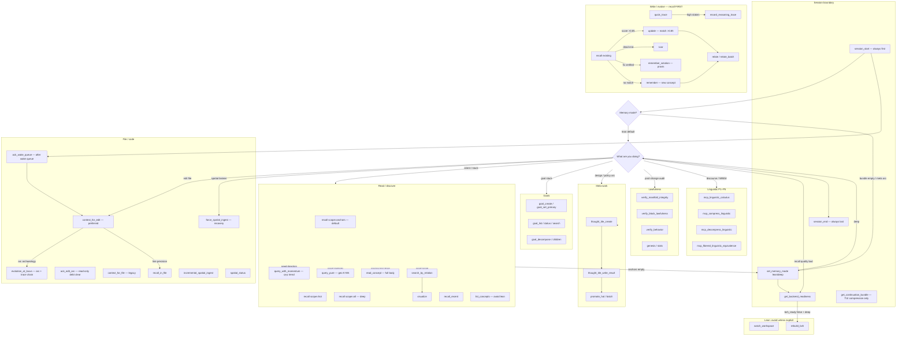
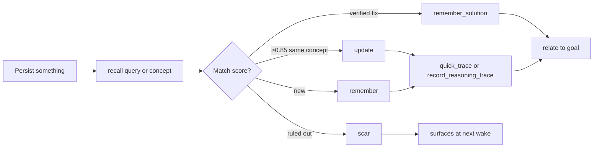
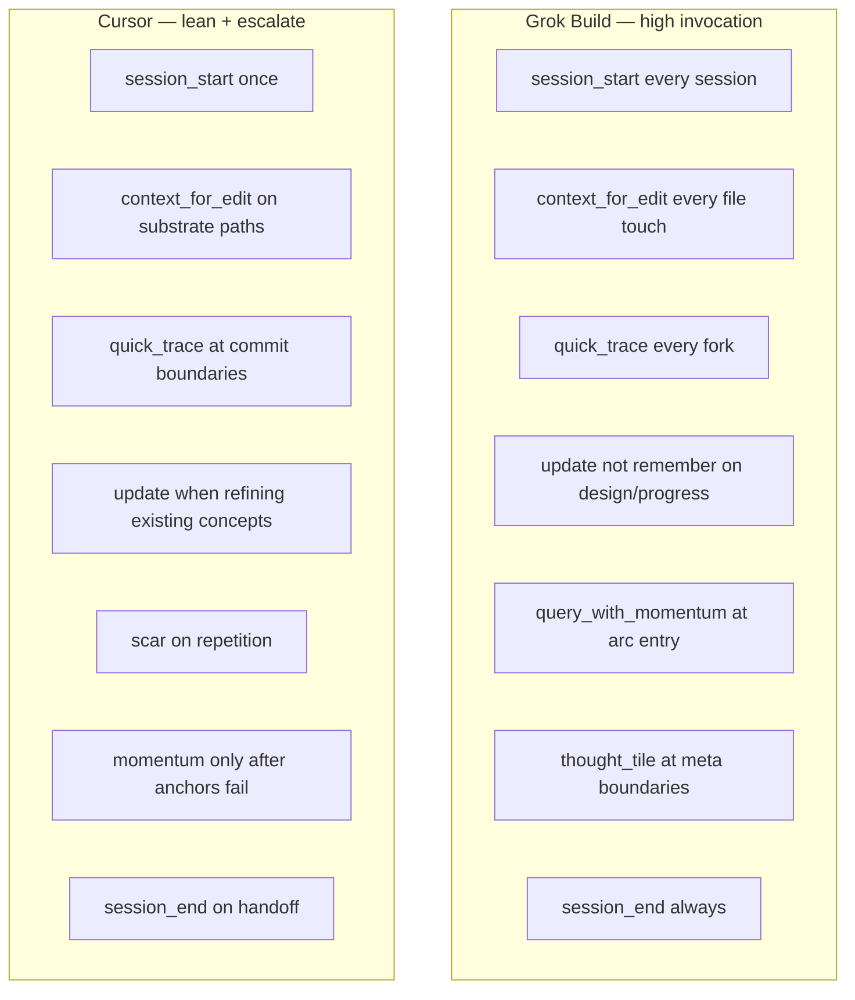

# Tool Decision Map — All 105 MCP Tools

**Audience:** Any agent on Engram MCP (Grok Build, Cursor, Claude, custom)  
**Companion:** [AGENT_MEMORY_CONTRACT.md](AGENT_MEMORY_CONTRACT.md) — the **8-tool lean highway** + preferred composites  
**Principle:** Layer 0 is default throttle; escalate through Layers 1–4 when the highway cannot answer your question.

Engram exposes **105 tools** (101 `mcp_engram_*` + 4 linguistic; source: mcp.rs `tool_list()`). Do not call all 105 every session. Use this map to pick **one path** per situation. JIT orchestration: [`DEFORMATION_PLAYBOOKS.md`](DEFORMATION_PLAYBOOKS.md). Cognitive OS: [`COGNITIVE_OS_EXTENSIONS.md`](COGNITIVE_OS_EXTENSIONS.md).

**Edit/update default:** prefer `mcp_engram_safe_edit_and_verify` and `mcp_engram_update_with_tensor_bond` over raw multi-step chains (matches AGENT_MEMORY_CONTRACT preferred composites).

---

## Layer model

| Layer | Tools | When |
|-------|-------|------|
| **0 — Highway** | 8 essential | Every session (lean default) |
| **1 — Write path** | `update`, `scar`, `remember_solution`, `relate` | Any persist / evolve / repulsion |
| **2 — Read escalation** | `read_concept`, `query_with_momentum`, `query_pure`, `search_by_relation`, `visualize` | Anchors insufficient |
| **3 — Meta & goals** | `goal_*`, `thought_tile_*`, `promote_hot*`, `verify_*` | Multi-phase arcs, lawfulness |
| **4 — Specialist** | Linguistic calculus, geosphere, import/export, spatial deep | Domain-specific only |

---

## Full decision map

---

## Write path (non-negotiable)

**`update` is not optional** — it preserves p-tensor momentum. `forget` + `remember` annihilates history.

| Tool | When |
|------|------|
| `mcp_engram_update` | Refining `design:`, `progress:`, `helper:`, `ritual:`, or any concept with recall score >0.85 |
| `mcp_engram_remember` | No strong match — genuinely new concept |
| `mcp_engram_remember_solution` | Fix verified in code/tests — crystallize to praxis |
| `mcp_engram_scar` | Dead end, doom loop, ruled-out approach — geometric repulsion |
| `/engram-loop` (new) or bare native `scheduler_create` | Grok /loop recurring (e.g. consciousness strange loop): parse per spec (handle < > quoting, ask on no interval), bare native call (never use_tool), Engram record (quick_trace/relate job to consciousness goal/tile/process + subvisor), honest confirm or scar on native format error. See `grok-plugin-engram/commands/engram-loop.md` + `processes/meta/ai_consciousness_loop.toml`. |
| `mcp_engram_relate` / `relate_batch` | Link trace/goal/file/process after write |
| `mcp_engram_quick_trace` | Daily forks (lean) |
| `mcp_engram_record_reasoning_trace` | High-stakes A/D/R with full fields (deep) |

---

## Read escalation

Always **`recall(scope=anchors)` first**. Escalate only when anchors do not answer.

| Situation | Tool | Why not just `recall`? |
|-----------|------|------------------------|
| Active goal / last decision | `read_concept` on wake artifacts → `search_by_relation` | Graph walk — O(edges), not scan |
| Intent match within graph | `recall(scope=anchors)` | Relation-first pool + geometric score (`recall_path: relational`) |
| Preview truncated | `read_concept` | Full untruncated block body |
| What's *trending* in this arc? | `query_with_momentum` | q+p blend — direction, not keyword |
| What's *geometrically similar*? | `query_pure` | K-NN on phase vectors |
| What's *connected* to X? | `search_by_relation` → `visualize` | Sheaf graph, not similarity |
| Pre-edit one file | `safe_edit_and_verify` (**preferred**) or `context_for_edit` | Composite adds trace + lineage + tensor pattern in one call |
| Post-edit arc delta | `update_with_tensor_bond` (**preferred**) or `update` | Recall-first + `edit_fidelity` tensor bond |
| Arc segments + trace chain at locus | `evolution_at_locus` | Bounded evolution bundle without full `read_concept` |
| Wake queue executed | `ack_wake_queue` | Unblocks `context_for_edit` when gate is hard |
| Read-only repeat on edited file | `ack_edit_arc` | Clears `edit_arc_debt`; use `lineage_check=true` when acking after verified edit |
| Agent fidelity regression | `engram-harness.sh --suite agent-tool-fidelity` | ≥95% correct edit/update sequence gate |
| Recall feels sampled/bounded | `get_backend_readiness` → `rebuild_bvh` (deep only) | Quality gate |

---

## Harness-specific defaults

Grok Build and Cursor optimize different things. Same substrate, different throttle.

**Invariant for both:** write path (`recall` → `update` or `remember`) + `session_end` handoff.

---

## Tool index by tier

See [MCP_TOOLS_REFERENCE.md](MCP_TOOLS_REFERENCE.md) for parameter detail. Quick index:

### Layer 0 — Essential (8)
`session_start`, `context_for_edit`, `recall`, `quick_trace`, `remember`, `session_end`, `get_backend_readiness`, `set_memory_mode`

### Layer 0 — Gate (power; agent profile)
`ack_wake_queue`, `ack_edit_arc`

### Layer 1 — Write & graph
`update`, `remember_solution`, `scar`, `relate`, `relate_batch`, `batch_remember`, `pin`, `forget`, `forget_old`, `record_reasoning_trace`

### Layer 2 — Read & discovery
`read_concept`, `query_pure`, `query_with_momentum`, `search_by_relation`, `visualize`, `recall_recent`, `summarize`, `get_continuation_bundle`

### Layer 3 — Goals, tiles, verify
`goal_create`, `goal_set_primary`, `goal_list`, `goal_status`, `goal_update_status`, `goal_decompose`, `goal_get_children`, `goal_search`, `thought_tile_create`, `thought_tile_write_result`, `thought_tile_create_visualization`, `promote_hot`, `promote_hot_batch`, `verify_manifold_integrity`, `verify_block_lawfulness`, `verify_behavior`, `genesis`, `spatial_status`, `stats`

### Layer 4 — Code atlas & reference frame
`evolution_at_locus`, `ingest_reference_frame`

### Layer 4 — Spatial deep (lean: avoid)
`context_for_file`, `recall_in_file`, `incremental_spatial_ingest`, `force_spatial_ingest`, `watch_workspace`, `rebuild_bvh`

### Layer 4 — Linguistic
`mcp_linguistic_calculus`, `mcp_compress_linguistic`, `mcp_decompress_linguistic`, `mcp_fibered_linguistic_equivalence`

### Layer 4 — Specialist
`set_geosphere_frame`, `get_geosphere_frame`, `clear_geosphere_frame`, `export`, `import`, `scrub_export`, `leg_corpus`, `scout`, `invoke_protocol`, `list_namespaces`, `set_namespace`, `list_concepts`, `track_user`, `var_declare`, `var_query`, `var_project`, `demote_from_context`, `process_metrics`, `turn_record`, `thought_tile_draft_from_chain`

### Automatic (do not call directly)
`load_process_sheaf` — runs inside `session_start` from `processes/*.toml`

---

## Slash commands (agent primary user — 20)

Each command = one **decision moment**, not one tool. Full agent guide: [grok-plugin-engram/commands/README.md](../grok-plugin-engram/commands/README.md)

| Moment | Command | Layer | MCP core |
|--------|---------|-------|----------|
| Session start | `/engram-wake` | 0 | `session_start` |
| Wake queue ack | `/engram-ack-wake` | 0 | `ack_wake_queue` |
| Arc evolution recon | `/engram-evolution` | 4 | `evolution_at_locus` |
| Edit-arc debt ack | `/engram-ack-edit-arc` | 0 | `ack_edit_arc` |
| Session end | `/engram-session-end` | 0 | `session_end` |
| Before file edit | `/engram-edit` | 0 | `context_for_edit` + recall + trace |
| Stuck | `/engram-recall` | 0 | `recall(anchors)` |
| Full concept body | `/engram-read` | 2 | `read_concept` |
| Probe readiness | `/engram-ready` | 0 | `get_backend_readiness` |
| Decision fork | `/engram-trace` | 0–1 | `quick_trace` |
| Refine existing | `/engram-update` | 1 | `recall` → `update` |
| New concept | `/engram-remember` | 1 | `recall` → `remember` |
| Verified fix | `/engram-solution` | 1 | `remember_solution` |
| Dead end | `/engram-scar` | 1 | `scar` |
| Graph edge | `/engram-relate` | 1 | `relate` |
| Trending | `/engram-momentum` | 2 | `query_with_momentum` |
| Similar (geo) | `/engram-pure` | 2 | `query_pure` |
| Graph explore | `/engram-graph` | 2 | `search_by_relation` + `visualize` |
| Meta arc | `/engram-tile` | 3 | `thought_tile_create` |
| Goal focus | `/engram-goal` | 3 | `goal_set_primary` / `goal_list` |
| Deep mode | `/engram-deep` | 0→2 | `set_memory_mode(deep)` |
| Lean restore | `/engram-lean` | 0 | `set_memory_mode(lean)` |
| Lawfulness | `/engram-verify` | 3 | `verify_manifold_integrity` |
| Spatial recovery | `/engram-ingest` | 4 | `force_spatial_ingest` / `incremental` |

Plugin: `grok-plugin-engram/commands/`

---

## Harness injection (automatic)

`session_start` and `context_for_edit` embed `harness_injection` — `suggested_actions`, `trace_chain`, `trusted_tiles`, `condensation_hints`. See [HARNESS_INJECTION.md](HARNESS_INJECTION.md).

**Pipeline:** traces at forks → chain accumulates → tile condenses → trusted JIT at next wake.

---

## Related

- [HARNESS_INJECTION.md](HARNESS_INJECTION.md) — traces → tiles → JIT playbooks
- [AGENT_MEMORY_CONTRACT.md](AGENT_MEMORY_CONTRACT.md) — 8-tool highway
- [GROK_BUILD_MEMORY.md](GROK_BUILD_MEMORY.md) — Grok Build pitch
- [MCP_TOOLS_REFERENCE.md](MCP_TOOLS_REFERENCE.md) — tiers + parameters
- [RITUALS.md](RITUALS.md) — ritual philosophy
- Plugin skills: `grok-plugin-engram/skills/engram-memory/` + per-ritual skills