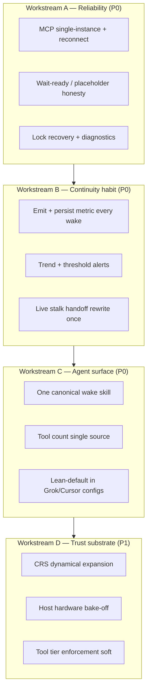

# Agent-Felt Gap Closure Plan v1

**Status:** P0 A–C shipped + Tier-1 dogfood verified (2026-07-08); D deferred  
**Audience:** You (builder) + any agent implementing this plan  
**North star (from agent review):** *Make the next instance of the agent on this machine feel like the same agent with less re-explaining, every time, with one number (cold-start fidelity) you can watch.*  
**Hardware context:** 96 GB DDR5, dual RTX 5060-class, fast NVMe (T700-class), local Engram store `~/.engram/stalks/`.  
**Baseline already shipped (do not re-do from zero):**

| Piece | Location |
|-------|----------|
| Handoff latest-wins + extract | `session_packet.rs`, `persist_session_handoff_latest` Replace |
| Primary goal on wake when marker exists | `resolve_primary_goal_for_continuation` |
| Cold-start fidelity scorer + MCP + ritual TOML | `cold_start_fidelity.rs`, `mcp_engram_cold_start_fidelity`, `processes/ritual/cold-start-fidelity.toml` |
| Dynamical CRS MVP (handoff/tile/tensor/manifest) | `crs_dynamical.rs` |
| Lean 8-tool contract docs (partially aligned) | `docs/AGENT_MEMORY_CONTRACT.md`, `docs/skills/engram-wake-up.md` |
| Module rename for gitignore | `session_packet.rs` (not `*handoff*`) |

---

## 1. Problem statement (gaps from agent review)

These are **agent-felt** gaps, not academic incompleteness.

| # | Gap | Why it hurts the agent | Priority |
|---|-----|------------------------|----------|
| G1 | **MCP reliability** (handshake fail, store lock, double spawn, placeholder races) | Continuity thesis is dead while tools are unavailable | P0 |
| G2 | **Continuity not measured as a habit** | Cold-start score exists but is not dashboarded / thresholded / trended | P0 |
| G3 | **Skill/doc sprawl vs lean contract** | Agents over-tool, burn context, contradict one-call wake | P0 |
| G4 | **Handoff SNR** | Latest-wins shipped; old multi-update dumps still on live stalk until rewritten | P0 |
| G5 | **CRS still mostly policy outside mint paths** | Agents can't trust "high CRS" as lawfulness | P1 |
| G6 | **cuFile/GDS honesty vs real DMA** | `unavailable` with hot_ready confuses hardware story | P1 |
| G7 | **Tool surface bloat (84 tools)** | Decision paralysis; lean contract not enforced in product UX | P1 |
| G8 | **Theory/myth surface without agent effect** | Opportunity cost; dilutes signal | P2 |
| G9 | **Multi-agent / shared store unfinished** | Not blocking single-user dogfood; defer | P2 |
| G10 | **mcp.rs / store.rs monoliths** | Slow iteration; high merge risk | P2 |

**Explicit non-goals for this program (defer):** full sheaf cohomology engine, multi-agent CRDT, Metal/ROCm parity, learned embedding channel as primary encode, LEG Browser redesign, marketplace submission, formal published paper.

---

## 2. Success definition

### Product success (human + agent)

After a cold TUI restart on the production stalk:

1. Engram MCP is **available within ≤30s** (or honest "still warming" with working `get_backend_readiness`).
2. One call: `session_start` → non-null `primary_goal` when marker exists → `cold_start_fidelity.score` present.
3. Agent executes queue + `ack_wake_queue` and can state **last decisions + open threads** without re-reading the whole repo.
4. `session_end` produces a **single** latest handoff packet (no multi-update dump on `read_concept`).
5. **Cold-start fidelity** median ≥ **0.85** over 10 consecutive wake cycles (same machine, same stalk).
6. You (human) can open LEG or a log line and see the last 10 scores without grepping chat.

### Failure modes this plan prevents

- "MCP server engram handshake failed" as default experience  
- Agents following deep wake skill and flooding `query_with_momentum`  
- High CRS that means "we assigned 0.94"  
- Roadmap work that never changes next-wake re-brief cost  

---

## 3. Program structure (4 workstreams)

Recommended order: **A → B → C → D**. Do not start D until A is green on *your* machine for a week of dogfood.

---

## 4. Workstream A — MCP reliability (P0)

### Goal
The agent almost never starts a session with "engram MCP unavailable."

### A1. Single-writer / single-MCP contract

| Item | Detail |
|------|--------|
| **Problem** | Second `engram … mcp` hits store lock; client reports handshake failure; orphan PID holds lock |
| **Do** | (1) Document "one MCP process per store" in FIRST_RUN + Grok launch. (2) `engram-grok`: if lock held by live PID, **attach-or-fail with clear stderr** (do not silent fail). (3) Orphan recovery already partial — extend: if holder PID is dead, remove lock; if alive but stdio dead >N s, optional `ENGRAM_MCP_FORCE_STEAL=1` for dev only. |
| **Files** | `scripts/engram-grok`, `mcp_lock.rs`, `docs/FIRST_RUN.md`, `integrations/grok-build/mcp.json` |
| **Done when** | Repro script: start MCP twice → second process exits with code ≠0 and message "PID … holds lock"; kill first → second starts clean. Evidence in SCRATCH. |
| **Effort** | 2–4 days |

### A2. Handshake / wait-ready races

| Item | Detail |
|------|--------|
| **Problem** | Client times out while wait-ready + full init still running; tools never register |
| **Do** | (1) Ensure `wait-ready` always runs before stdio MCP (already). (2) Cap wait-ready logging noise. (3) Fast path: answer `initialize` + `tools/list` from placeholder; **never drop registration** after `session_start`. (4) Add smoke: `tools/list` within 5s of spawn on empty store; on 80k store within 30s after wait-ready. |
| **Files** | `main.rs` mcp arm, `store.rs` placeholder upgrade, harness `agent-memory` suite |
| **Done when** | `tools/test-harness --suite agent-memory` green 3× consecutive on production binary; no "handshake failed" in Grok logs for fresh session after `scripts/engram-grok` path. |
| **Effort** | 3–5 days |

### A3. Diagnostics agents can use without FS spelunking

| Item | Detail |
|------|--------|
| **Do** | `mcp_engram_get_backend_readiness` already exists. Add **one** human/agent-facing status line at session_start: `mcp_health: {lock_ok, fully_initialized, recall_mode, cufile_transfer_path, cold_start_fidelity}`. Optional CLI: `engram --store … status` (no MCP). |
| **Done when** | Agent can print health from wake packet alone. |
| **Effort** | 1–2 days |

### A acceptance (Workstream A)

- [ ] 10× cold start of Grok/TUI on Engram workspace: Engram tools visible every time  
- [ ] Double-launch lock behavior documented + tested  
- [ ] Harness agent-memory 3× green  

---

## 5. Workstream B — Continuity as a habit (P0)

### Goal
Cold-start fidelity is not a dead field in JSON — it is the **KPI of the product**.

### B1. Persist every wake score

| Item | Detail |
|------|--------|
| **Do** | On successful `session_start`, mint `metric:cold_start_fidelity_<unix>` (or append-only `helper:cold_start_fidelity_series`) with score + components. Relate to `session_start_*` and `primary_goal`. |
| **Files** | `session_lifecycle` / `mcp.rs` session_start path, `cold_start_fidelity.rs` |
| **Done when** | Unit test: two wakes → two metric blocks or series with increasing timestamps; scores in [0,1]. |
| **Effort** | 1–2 days |

### B2. Threshold + soft nudge

| Item | Detail |
|------|--------|
| **Do** | If score < 0.70 at wake, inject **one** high-priority `suggested_actions` item: `read_concept(helper:session_handoff_latest)` + `get_continuation_bundle`. Never block work. Log reason codes (missing goal / no BVH / empty manifest). |
| **Done when** | Test with empty store → low score + nudge present; store with goal+handoff+BVH → score ≥0.85 and no fidelity nudge. |
| **Effort** | 1–2 days |

### B3. One-shot live stalk hygiene

| Item | Detail |
|------|--------|
| **Do** | Script or MCP path: rewrite `helper:session_handoff_latest` to **only** latest structured packet (call `extract_latest` + Replace). Run once on `~/.engram/stalks/`. |
| **Done when** | `read_concept(helper:session_handoff_latest)` length < previous; contains single `SESSION HANDOFF PACKET v1`. |
| **Effort** | 0.5 day (ops) |

### B4. Human-visible trend (minimal)

| Item | Detail |
|------|--------|
| **Do** | Either: (a) LEG small panel "last 10 cold-start scores", or (b) `scripts/cold-start-report.sh` printing last 10 metrics from store. Prefer (b) first. |
| **Done when** | You can run one command after a week of dogfood and see a table of scores. |
| **Effort** | 1 day (script) / 3–5 days (LEG) |

### B acceptance

- [ ] Median cold-start fidelity ≥ 0.85 over 10 wakes (your stalk)  
- [ ] Score always present on `session_start` continuation  
- [ ] Handoff read is single packet  

---

## 6. Workstream C — Agent surface clarity (P0)

### Goal
One path for every agent: **8 tools + ack + safe composites**. Deep mode is opt-in.

### C1. Single canonical wake skill

| Item | Detail |
|------|--------|
| **Problem** | `docs/skills/engram-wake-up.md` (lean one-call) vs `.grok/skills/engram-wake-up/SKILL.md` (deep multi-call) still diverge in spirit |
| **Do** | (1) Make public skill **canonical**. (2) Grok skill becomes a thin wrapper: "lean first; deep only if `set_memory_mode(deep)` or cold_start_fidelity < 0.7". (3) Delete or archive contradictory multi-call lean lists. (4) Add acceptance test: skill files contain the string "one-call" / "session_start" and do **not** list `query_pure` as mandatory at lean wake. |
| **Files** | `docs/skills/engram-wake-up.md`, `.grok/skills/engram-wake-up/SKILL.md`, optionally `docs/RITUALS.md` pointer only |
| **Done when** | Grep-based CI check or unit test on skill text; human can give a new agent only AGENT_MEMORY_CONTRACT + wake skill. |
| **Effort** | 1–2 days |

### C2. Tool count single source of truth

| Item | Detail |
|------|--------|
| **Do** | Build-time or test: parse `tool_list()` names → assert docs numbers, or generate `docs/generated/TOOL_SURFACE.md`. Stop hand-editing 79/80/81/84. |
| **Files** | `mcp.rs` test, `docs/MCP_TOOLS_REFERENCE.md`, `TOOL_DECISION_MAP.md` |
| **Done when** | `cargo test` fails if doc count string mismatches tool_list length. |
| **Effort** | 1 day |

### C3. Lean-default product UX

| Item | Detail |
|------|--------|
| **Do** | Ensure `ENGRAM_PROFILE=agent` is the only recommended Grok/Cursor config. Power tools remain but **suggested_actions never includes** lean-avoid tools (`watch_workspace`, `rebuild_bvh`, broad `summarize`) at wake. |
| **Done when** | Unit test on `build_suggested_actions` / slim bundle: none of the lean-avoid set appear in top-5 at wake for agent profile. |
| **Effort** | 1–2 days |

### C acceptance

- [ ] New agent onboarding: 2 docs only (contract + wake skill)  
- [ ] Doc tool counts always match `tool_list`  
- [ ] Wake queue never suggests lean-avoid tools  

---

## 7. Workstream D — Trust substrate (P1)

Only after A–C are green for a week of personal dogfood.

### D1. CRS dynamical expansion

| Item | Detail |
|------|--------|
| **Do** | Expand `dynamical_crs` to: pin path, ego-gated remember, scar demotion, praxis mint. Document formula in `docs/LAWFULNESS_VERIFICATION_PRIMITIVES.md` (short "Runtime CRS" section). Property tests: pin=1; update does not freely set 0.95 without function. |
| **Non-goal** | Replace every literal in monorepo. |
| **Effort** | 1 week |

### D2. Hardware bake-off (this machine)

| Item | Detail |
|------|--------|
| **Do** | Microbench: 1k block q-loads O_DIRECT+H2D vs cuFile DMA when available. Publish numbers in `docs/plans/` or CHANGELOG. Dual-GPU policy written: hot device 0 for BVH/hot set; compute 1 for NREM/batch. Fix labeling so path is never `cufile_dma` without success (already partial). |
| **Done when** | Table: path, p50/p95 latency, success rate; `hw_readiness` script in `scripts/`. |
| **Effort** | 3–5 days |

### D3. Soft tool-tier enforcement

| Item | Detail |
|------|--------|
| **Do** | Optional `ENGRAM_TOOL_TIER=lean|power|all`. Lean mode: power tools return soft warning + still work, or hard-block only for known harmful set (`rebuild_bvh` on large store without deep mode). Prefer **warn** first. |
| **Effort** | 3–5 days |

### D4. Monolith extract (optional, if velocity dies)

| Item | Detail |
|------|--------|
| **Do** | Extract `load_process_sheaf` + tool dispatch slices from `mcp.rs` **without behavior change** (mechanical). Stop if >2 days without green harness. |
| **Effort** | 1–2 weeks continuous / or skip |

---

## 8. Phased calendar (suggested)

Assume part-time human + agent implementers.

| Week | Focus | Exit criteria |
|------|--------|----------------|
| **1** | Workstream A (MCP lock, handshake, harness 3×) | 10 cold starts, tools always present |
| **2** | Workstream B (persist scores, nudge, stalk handoff rewrite, report script) | 10 wakes, median fidelity ≥0.85 |
| **3** | Workstream C (skill single-source, tool count CI, lean queue hygiene) | New agent onboard on 2 docs |
| **4** | Dogfood only — no new features; log fidelity daily | Trend flat or up; zero MCP blackouts |
| **5–6** | Workstream D1–D2 (CRS + hardware bake-off) | Doc + numbers published |
| **7+** | D3 optional; defer multi-agent / H¹ / LEG redesign | — |

If Week 1 fails (MCP still flaky), **do not** start B–D feature work. Reliability first.

---

## 9. Implementation checklist (agent-executable)

Use this as a todo list for implementers.

### Phase 0 — Prep
- [ ] Read this plan + `docs/AGENT_MEMORY_CONTRACT.md`
- [ ] Confirm binary: `target/debug/engram --version` matches workspace
- [ ] Baseline: run `mcp_engram_cold_start_fidelity` (or session_start) once; record score in SCRATCH

### Phase 1 — Reliability
- [ ] A1 lock behavior tests + docs  
- [ ] A2 harness agent-memory 3×  
- [ ] A3 health line on session_start  

### Phase 2 — Continuity habit
- [ ] B1 persist metric every wake  
- [ ] B2 low-score nudge  
- [ ] B3 rewrite live handoff once  
- [ ] B4 `scripts/cold-start-report.sh`  

### Phase 3 — Surface
- [ ] C1 skill alignment + grep test  
- [ ] C2 tool_list count test  
- [ ] C3 lean-avoid banned from wake queue  

### Phase 4 — Trust
- [ ] D1 CRS expansion + lawfulness doc blurb  
- [ ] D2 hardware microbench on dual-GPU/NVMe  
- [ ] D3 tool tier soft mode (optional)  

### Phase 5 — Close
- [ ] 10-wake fidelity table in SCRATCH or CHANGELOG  
- [ ] Update this plan status → **Shipped** with date  
- [ ] `session_end` with summary of scores + remaining risks  

---

## 10. Validation strategy

| Layer | Command / action | Pass |
|-------|------------------|------|
| Unit | `cargo test -p engram-server` (fidelity, CRS, session_packet, lock) | 0 fail |
| Harness | `STABLE_BIN=target/debug/engram tools/test-harness/bin/engram-harness.sh --suite agent-memory` ×3 | failures=0 |
| Continuity | 10× TUI restart + session_start; collect scores | median ≥0.85 |
| Reliability | 10× cold start; tools listed | 10/10 |
| Docs | grep skill for forbidden mandatory multi-call lean list | clean |
| Hardware | microbench script on this host | numbers logged |

**Agent dogfood protocol (weekly):**  
Wake → note score → 30 min real work with 8-tool contract only → session_end → next day: did you re-brief less? Yes/No logged next to score.

---

## 11. Effort summary

| Workstream | Effort | Impact on "same agent next wake" |
|------------|--------|----------------------------------|
| A Reliability | ~1–1.5 weeks | Critical — without it, nothing else matters |
| B Continuity habit | ~1 week | High — makes progress visible |
| C Surface | ~3–5 days | High — reduces agent behavior |
| D Trust substrate | ~2–3 weeks | Medium — deepens trust after habit |

**Total to "dogfood-solid" (A+B+C):** ~3–4 weeks part-time.  
**Total to "hardware-honest + CRS broader" (A–D):** ~6–8 weeks.

---

## 12. What to ignore (so you do not waste time)

| Temptation | Why skip now |
|------------|----------------|
| Full H¹ / categorical sheaf runtime | Doesn't fix next-wake re-brief |
| 10 more MCP tools | Opposite of lean |
| Sacred frequency / mythology polish | Zero agent utility |
| Multi-agent shared memory | You are single-user dogfood |
| Port to every GPU vendor | Own the dual 5060 + T700 path first |
| Rewriting encode to learned embeddings | Only after cold-start ≥0.9 stable |

---

## 13. Decision you should make once

**Choose a kill criterion:**

> If after Workstream A+B (≈2 weeks of focused work) cold-start fidelity cannot stay ≥0.75 on your stalk **and** MCP is still unavailable ≥20% of cold starts, stop feature work and either: (1) fix only reliability for another week, or (2) freeze Engram as research artifact and use a thinner memory layer for daily agents.

Having an explicit kill criterion protects you from infinite perfectionism.

---

## 14. First three concrete tasks (start tomorrow)

1. **Repro pack for MCP flakiness** — script that starts Grok-like MCP spawn twice, captures stderr/lock, writes SCRATCH/repro-mcp-lock.txt.  
2. **Persist cold_start_fidelity metric on every session_start** — small PR, unit tested.  
3. **Rewrite live `helper:session_handoff_latest` once** + run `scripts/cold-start-report.sh` (even if report is 20 lines of Python against store via MCP).

Those three alone make the product feel more real than another geometric essay.

---

## 15. References

- Agent review (session): continuity KPI = cold-start fidelity; reliability first  
- `docs/AGENT_MEMORY_CONTRACT.md` — lean 8-tool highway  
- `docs/HARNESS_INJECTION.md` — wake gates  
- `docs/plans/theory-informed-agent-memory-v1.md` — prior continuity spikes  
- Shipped MVP modules: `cold_start_fidelity.rs`, `crs_dynamical.rs`, `session_packet.rs`  
- Process: `processes/ritual/cold-start-fidelity.toml`, `processes/ritual/wake-up.toml`

---

*Plan version: agent-felt-gap-closure-v1 · 2026-07-08*
