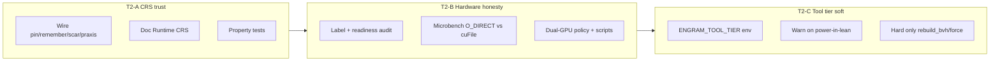

# Tier 2 Plan — Trust & Hardware Substrate Alignment v1

**Status:** Shipped (2026-07-08) — T2-A/B/C closed; optional T2-D skipped  
**Parent:** Brainstorm “what next?” · Tier 1 = continuity dogfood (shipped/proven) · Tier 2 = **trust the numbers + hardware story matches the box**  
**Companion plan:** [agent-felt-gap-closure-v1.md](agent-felt-gap-closure-v1.md) Workstream D (expanded here into an executable program)  
**Audience:** Builder + implementing agents  
**Hardware target:** 96 GB DDR5 · dual RTX 5060-class · Samsung T700-class NVMe · store `~/.engram/stalks/`  
**Date:** 2026-07-08  

---

## 0. Why Tier 2 exists

Tier 1 made the **agent feel continuous** (wake packet, fidelity habit, MCP lock honesty, lean surface).

Tier 2 makes the **substrate trustworthy**:

1. **CRS means something** — not free literals like `0.94` painted onto blocks.  
2. **Hardware claims match readiness** — `cufile_hot_ready` vs actual DMA path; dual-GPU roles explicit.  
3. **Tool surface is disciplined** — lean/power/all so 84 tools don’t thrash agents (soft first).

**North star (Tier 2):** *An agent (or human) can trust CRS, readiness, and tool tiers without spelunking code or myths.*

**Explicit non-goals (still deferred):** full H¹ sheaf engine, multi-agent CRDT, Metal/ROCm parity, learned embeddings as primary encode, LEG redesign, marketplace, formal paper, full `mcp.rs` rewrite (optional mechanical extract only if velocity dies).

---

## 1. Baseline already present (do not rebuild)

| Piece | Location | Gap for Tier 2 |
|-------|----------|----------------|
| `dynamical_crs` MVP | `crs_dynamical.rs` | Only wired on handoff/manifest/receipt/tile/tensor/sentinel mints — not pin/remember/scar/praxis |
| Fidelity + `mcp_health` | `cold_start_fidelity.rs`, `session_start` | Surfaces `cufile_transfer_path` but does not prove DMA |
| cuFile modes | `engram-gpu/src/cufile.rs` | Labels exist; live often `unavailable` with `hot_ready=true` |
| Dual device env | readiness `gpu_hot_device` / `gpu_compute_device` | No written policy + no scheduler doc/tests |
| Lean-avoid at **wake only** | `finalize_wake_suggested_actions` | No general `ENGRAM_TOOL_TIER` |
| Tier 1 dogfood | fidelity series, lock repro | Must stay green; Tier 2 must not regress |

---

## 2. Problem → success mapping

| # | Problem (agent-felt) | Success criterion |
|---|----------------------|-------------------|
| T2-1 | “High CRS” = we assigned a constant | Pin / ego-remember / scar / praxis call `dynamical_crs`; lawfulness doc has Runtime CRS section; property tests |
| T2-2 | Readiness says hot but transfer path lies or is opaque | Honest labels only; microbench table on this host; `scripts/hw_readiness.sh` + optional microbench log |
| T2-3 | Dual GPUs unused / unexplained | Policy doc + readiness fields consistent with env; smoke that hot≠compute when both set |
| T2-4 | 84 tools still invite misuse mid-session | `ENGRAM_TOOL_TIER=lean\|power\|all` soft-warns (or hard only for harmful set); unit tests |
| T2-5 | Tier 1 regresses under D work | Fidelity + lock + harness still pass |

---

## 3. Program structure (three workstreams + optional)

**Order:** **T2-A → T2-B → T2-C**. Soft tool-tier last so CRS/hardware land first.  
**Optional T2-D:** mechanical extract of `load_process_sheaf` only if mid-program velocity dies (stop-loss 2 days).

---

## 4. Workstream T2-A — Dynamical CRS expansion

### Goal
CRS on **high-value write paths** is computed, not painted.

### A1. Inventory free CRS literals (one-time audit)

| Item | Detail |
|------|--------|
| **Do** | `rg 'crs_score\s*=\s*0\.' crates/engram-server` → classify: keep (tests), mint path, pin, scar, praxis, ego. |
| **Deliverable** | Short table in this plan’s appendix or `docs/LAWFULNESS_VERIFICATION_PRIMITIVES.md` “literal inventory”. |
| **Effort** | 0.5 day |

### A2. New roles + wiring

Extend `CrsRole` (or inputs) and call sites:

| Path | Role / inputs | Files (expected) |
|------|----------------|------------------|
| `pin` / immortal | `pinned: true` → 1.0 | `store.rs` pin |
| Ego-gated `remember` | `ego_resonance` from ego cosine + residual | `store.rs` remember |
| `scar` demotion | lower base + residual; never invent 0.40 without function | `store.rs` scar |
| Praxis / `remember_solution` | high base + optional verify_count | remember_solution path |
| Existing handoff/tile/tensor | already wired — regression only | `store`, `tensor_tile_bridge` |

**Formula stays the MVP formula** unless audit finds a bug; expand **call sites**, not invent a second scorer.

### A3. Documentation

| Item | Detail |
|------|--------|
| **Do** | Add **Runtime CRS** section to `docs/LAWFULNESS_VERIFICATION_PRIMITIVES.md`: formula, Kepler 0.74, pin=1.0, which paths use it, which still use policy (list remaining). |
| **Effort** | 0.5 day |

### A4. Tests (no theater)

| Test | Asserts |
|------|---------|
| `pin_sets_crs_one_via_dynamical` | pin path → `crs_score == 1.0` via function |
| `scar_crs_below_prior_or_role` | scar uses scorer; result ∈ [0.74, 0.99] unless designed lower with explicit role |
| `remember_ego_path_calls_dynamical` | after remember with ego, CRS not a raw constant outside clamp |
| Existing `crs_dynamical` unit suite still green | |

### T2-A acceptance

- [x] Free CRS assign on pin/scar/praxis/ego-remember replaced or justified in inventory  
- [x] Runtime CRS doc section merged  
- [x] Property/unit tests pass on **shipped** store methods  
- [x] No regression: handoff/tile/tensor still use dynamical CRS  

**Effort:** ~5–7 days  

---

## 5. Workstream T2-B — Hardware honesty (this box)

### Goal
`mcp_health` / readiness tell the truth about **this** dual-GPU + NVMe machine.

### B1. Label contract (code + tests)

| Rule | Implementation |
|------|----------------|
| `cufile_dma` **only** if last DMA attempt succeeded | Already partial in `cufile.rs` — audit all set_transfer_mode call sites |
| `hot_ready && transfer_path=unavailable` is **valid** (driver open, no successful DMA yet) | Document in readiness hint string |
| Never claim DMA success without `cufile_last_dma_success()` | Unit/integration already partly there — extend |

### B2. Microbench harness

| Item | Detail |
|------|--------|
| **Script** | `scripts/hw_microbench_qload.sh` (or Rust bench under `engram-gpu`/`engram-server`) |
| **Workload** | N=256 or 1024 random/hot `.leg` q-region loads (64 KiB q) |
| **Paths** | (1) O_DIRECT read + H2D memcpy  (2) cuFile DMA when eligible  (3) CPU mmap fallback |
| **Metrics** | p50/p95 latency ms, success rate, final `cufile_transfer_path` |
| **Output** | `{SCRATCH}/hw_microbench.txt` + paste summary into `docs/plans/tier2-hardware-results.md` or CHANGELOG |
| **Host env** | `ENGRAM_CUFILE_HOT=1`, `ENGRAM_GPU_HOT_DEVICE=0`, `ENGRAM_GPU_COMPUTE_DEVICE=1` |

**Pass criterion:** Table exists with real numbers; DMA row may be “N/A / unavailable” if GDS path fails — **honest failure is pass**.

### B3. Dual-GPU policy (written + smoke)

| Policy | Detail |
|--------|--------|
| Device 0 | Hot set + BVH query / residency (default `ENGRAM_GPU_HOT_DEVICE=0`) |
| Device 1 | Batch encode / NREM / heavy compute (`ENGRAM_GPU_COMPUTE_DEVICE=1`) |
| Doc | Short section in `docs/CONTEXT_INJECTION_NVME_BYPASS.md` or new `docs/HARDWARE_DUAL_GPU.md` |
| Smoke | Test or script asserts readiness exposes both fields; when both env set, values match |

### B4. Operator script

| Item | Detail |
|------|--------|
| **`scripts/hw_readiness.sh`** | Runs `engram wait-ready` or readiness JSON dump; prints path, devices, BVH, transfer_path |
| **Done when** | One command after cold boot answers “is hardware story true today?” |

### T2-B acceptance

- [x] Label honesty tests green  
- [x] Microbench log with p50/p95 (or documented skip with reason)  
- [x] Dual-GPU policy doc + env smoke  
- [x] `hw_readiness.sh` shipped  

**Effort:** ~3–5 days  

---

## 6. Workstream T2-C — Soft tool-tier enforcement

### Goal
Agents default to the 8-tool highway **during the whole session**, not only at wake.

### C1. Env contract

| Value | Behavior |
|-------|----------|
| `lean` (default under `ENGRAM_PROFILE=agent` if unset) | Power tools allowed but return **soft warning** in MCP response meta; hard-block only **harmful** set |
| `power` | Full surface, no warn |
| `all` | Alias of power (or includes specialist tools with no warn) |

**Harmful set (hard in lean unless deep memory mode):**

- `mcp_engram_rebuild_bvh` on large store without `memory_mode=deep`  
- `mcp_engram_force_spatial_ingest` without explicit max_files cap (optional)  
- Keep `watch_workspace` as **warn**, not hard (passive may be needed)

### C2. Implementation sketch

| Piece | Detail |
|-------|--------|
| **Resolve tier** | `profile.rs` or small `tool_tier.rs` |
| **Gate** | Early in `handle_tool_call`: if lean && power tool → append warning field; if lean && harmful → isError |
| **Tier lists** | Essential 8 + safe composites as “lean-ok”; rest “power” |
| **Tests** | `rebuild_bvh` in lean → error or require deep; `recall` in lean → ok; power tool in lean → warning present |

### C3. Docs

| Item | Detail |
|------|--------|
| Update | `AGENT_MEMORY_CONTRACT.md`, `MCP_TOOLS_REFERENCE.md` — one paragraph on `ENGRAM_TOOL_TIER` |
| Do **not** change tool_list count test contract without updating docs in same PR |

### T2-C acceptance

- [x] Env resolved and documented  
- [x] Soft warn path unit-tested  
- [x] Hard harmful set unit-tested  
- [x] Agent profile defaults lean tier  

**Effort:** ~3–5 days  

---

## 7. Optional T2-D — Mechanical modularity (stop-loss)

| Item | Detail |
|------|--------|
| **When** | Only if T2-A/B/C edits keep colliding in `mcp.rs` |
| **Do** | Extract `load_process_sheaf` to `process_sheaf.rs` **no behavior change** |
| **Stop** | >2 days without green harness → abandon, leave note in Deviations |
| **Effort** | 0–2 weeks or skip |

---

## 8. Phased calendar (suggested)

| Week | Focus | Exit |
|------|--------|------|
| **0** | Confirm Tier 1 still green (fidelity series, lock repro, harness once) | No blackouts |
| **1** | T2-A inventory + pin/scar/praxis/ego wiring + doc | CRS tests green |
| **2** | T2-B microbench + dual-GPU policy + hw_readiness | Numbers or honest N/A |
| **3** | T2-C soft tool tier | Warn/hard tests green |
| **4** | Dogfood: 1 week agents on dual-GPU box; no new features | Readiness + CRS feel “true” |

If Week 1 CRS work blows the monorepo with behavior changes, **narrow to pin + praxis only** before scar/remember.

---

## 9. Agent-executable checklist

### Prep
- [x] `target/debug/engram --version` matches tree  
- [x] `./scripts/repro-mcp-lock.sh` + `./scripts/cold-start-report.sh` still pass/empty-ok  
- [x] Record baseline `mcp_health` after one wake  

### T2-A
- [x] Literal CRS inventory  
- [x] Wire pin / ego-remember / scar / praxis  
- [x] Runtime CRS doc  
- [x] Property tests  

### T2-B
- [x] Label audit + tests  
- [x] Microbench script + SCRATCH log  
- [x] Dual-GPU policy doc  
- [x] `scripts/hw_readiness.sh`  

### T2-C
- [x] `tool_tier.rs` + handle_tool_call gate  
- [x] Soft warn + hard harmful tests  
- [x] Docs  

### Close
- [x] Full `cargo test -p engram-server` (+ gpu if touched)  
- [x] Harness agent-memory once  
- [x] Update this plan status → **Shipped** with date  
- [x] session_end summary: what CRS paths remain literal  

---

## 10. Validation strategy

| Layer | Action | Pass |
|-------|--------|------|
| Unit | `cargo test -p engram-server` CRS + tool_tier + readiness | 0 fail |
| GPU | `cargo test -p engram-gpu cufile` (if labels change) | 0 fail |
| Script | `scripts/hw_readiness.sh` + microbench | output in SCRATCH |
| Harness | agent-memory once | failures=0 |
| Regression | Tier-1: two-wake fidelity, lock repro, lean-avoid | still green |
| Optional | Live stalk: CRS sample of pinned vs new remember | manual note |

---

## 11. Effort summary

| Workstream | Effort | Agent impact |
|------------|--------|--------------|
| T2-A CRS | ~1 week | High — trust “grounded” claims |
| T2-B Hardware | ~3–5 days | High — stop lying about DMA/GPU |
| T2-C Tool tier | ~3–5 days | Medium-high — mid-session discipline |
| T2-D Extract | optional | Dev velocity only |

**Total:** ~2.5–4 weeks part-time to “trustworthy on this box.”

---

## 12. Kill / narrow criteria

1. If CRS expansion causes harness or lawfulness flakiness → **only pin + praxis**, document rest as remaining literals.  
2. If cuFile DMA never succeeds on host → **publish H2D numbers as primary path**; keep DMA as best-effort, no more engineering time.  
3. If soft tool-tier confuses agents → ship **warn-only** without hard blocks for one week, then reassess.

---

## 13. First three concrete tasks (start day 1)

1. **CRS literal inventory** → markdown table of free `crs_score = 0.xx` with owner path.  
2. **Wire `pin` through `dynamical_crs(pinned=true)`** + unit test.  
3. **`scripts/hw_readiness.sh`** dumping readiness JSON fields after `wait-ready` (even before microbench).

Those three prove Tier 2 is moving without a multi-week redesign.

---

## 14. Relation to Tier 1 / Tier 3

| Tier | Focus | Status |
|------|--------|--------|
| **1** | Dogfood continuity, fidelity habit, MCP lock | Proven / in tree |
| **2** | CRS trust + hardware honesty + soft tool tier | **This plan** |
| **3** | Product surface polish for strangers (composites-as-default, onboarding) | Later |
| **4+** | Monolith split, multi-agent, LEG panels | Later |

---

## 15. References

- Brainstorm: Tier 2 = “Trust / hardware — CRS + cuFile/dual-GPU”  
- [agent-felt-gap-closure-v1.md](agent-felt-gap-closure-v1.md) §7 Workstream D  
- `crates/engram-server/src/crs_dynamical.rs`  
- `crates/engram-gpu/src/cufile.rs`  
- `docs/LAWFULNESS_VERIFICATION_PRIMITIVES.md`  
- `docs/CONTEXT_INJECTION_NVME_BYPASS.md`  
- `docs/AGENT_MEMORY_CONTRACT.md`  

---

---

## Appendix A — CRS literal inventory (T2-A audit, 2026-07-08)

`rg 'crs_score\s*=\s*0\.' crates/engram-server` classified:

| Class | Paths | Tier-2 action |
|-------|-------|---------------|
| **Migrated (dynamical)** | pin, scar, ego-remember, praxis/protocol, genesis seed pin, session export pin, handoff/manifest/receipt/sentinel, relation, selected operational | Done |
| **Policy keep (episodic/UI)** | session_start markers 0.80–0.93, goal mint 0.90–0.95, compression events 0.93, ki_hijacker TUI 0.72–0.73, scout 0.9, session_lifecycle 0.78–0.80 | Justified — not trust claims for grounded lawfulness |
| **Test fixtures** | edit_fidelity test blocks 0.85–0.92 | Keep |
| **Deferred next pass** | thought_tile MCP handlers 0.87–0.88, some tensor_tile_bridge assigns, primary_goal marker 0.95 | Prefer `CrsRole::ThoughtTile` when touching those handlers |

Trust band for agents: pin/praxis/scar/ego-remember/handoff/manifest/relation via `crs_dynamical`.

---

## Appendix B — Ship notes (2026-07-08)

| Artifact | Location |
|----------|----------|
| Dynamical CRS | `crates/engram-server/src/crs_dynamical.rs` |
| Soft tool tier | `crates/engram-server/src/tool_tier.rs` |
| Dual-GPU policy | `docs/HARDWARE_DUAL_GPU.md` |
| Runtime CRS doc | `docs/LAWFULNESS_VERIFICATION_PRIMITIVES.md` §8 |
| Scripts | `scripts/hw_readiness.sh`, `scripts/hw_microbench_qload.sh` |
| Evidence | `/tmp/engram-tier2/hw_readiness.txt`, `hw_microbench.txt` |
| Tests | `pin_sets_crs_one_via_dynamical`, `scar_crs_via_dynamical_below_prior`, `remember_solution_praxis_pinned_via_dynamical`, `tool_tier::*` |

T2-D (mcp.rs extract) **not** taken — velocity OK.

*Plan version: tier2-trust-hardware-v1 · shipped 2026-07-08*
